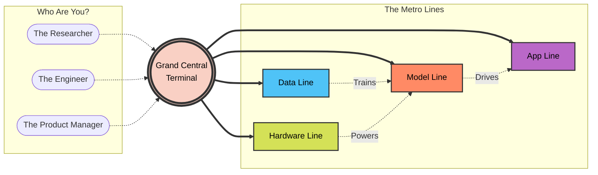

# 🚉 The Grand Central Terminal (The Master Navigation Guide)

Welcome to the **Grand Central Terminal** of the AI Metro Map! 

If you've ever stood in a massive transit hub like Grand Central in New York or Shinjuku in Tokyo, you know the feeling: hundreds of tracks, thousands of people rushing in different directions, and a dizzying array of colorful lines on a map. The world of Artificial Intelligence is exactly like that. 

Whether you're looking at neural networks, cloud computing, or generative chatbots, all these distinct "lines" eventually connect. This guide is your master map to understanding how the whole system intertwines, which train you should board based on your career, and how to reach your ultimate destination.

---

## 🗺️ How All the Lines Connect

In our AI Metro system, there are four major lines. They don't operate in isolation; they depend on one another to keep the trains moving.

1. **The Infrastructure & Hardware Line (The Tracks):** You can't run a train without tracks. This line represents the GPUs, TPUs, and cloud servers (like AWS or Google Cloud) that provide the raw computational power required for AI.
2. **The Data Line (The Electricity):** Trains need power. This line represents data collection, cleaning, and storage. Without massive, high-quality datasets, the AI models have nothing to learn from.
3. **The Core Models Line (The Engines):** This is where the magic happens. Here you'll find the Large Language Models (LLMs), vision models, and reinforcement learning algorithms. They are the engines that pull the heavy freight.
4. **The Applications Line (The Destinations):** This is where the passengers actually want to go. These are the user-facing tools like ChatGPT, Midjourney, or enterprise AI software that solve real-world problems.

### The Transit Hub Diagram

---

## 🧑‍💼 Choose Your Persona: Which Train to Catch?

When you walk into Grand Central, your ticket dictates your platform. In the AI world, your **career persona** determines which lines you'll spend the most time riding.

### 🔬 The Researcher (The Explorer)
You are the pioneer looking for new routes. Your job isn't necessarily to build the final passenger train, but to figure out if a new type of engine can run faster or more efficiently. 
* **Your Main Lines:** The Data Line & The Core Models Line.
* **Your Daily Commute:** You spend your time tweaking algorithms, experimenting with new neural network architectures, and reading the latest academic papers. You care about *why* the train moves.

### 🛠️ The Engineer (The Track Builder)
You are the pragmatist making sure the trains run on time without derailing. You take the prototypes built by researchers and scale them up so millions of people can use them.
* **Your Main Lines:** The Infrastructure Line & The Core Models Line.
* **Your Daily Commute:** You are optimizing cloud costs, ensuring APIs don't crash under pressure, and building the pipelines that feed data into the models. You care about *how* the train stays on the tracks.

### 🎯 The Product Manager (The Conductor)
You are the visionary making sure the train actually takes passengers where they want to go. You might not know how to build the engine, but you know exactly what the riders need.
* **Your Main Lines:** The Applications Line (with an eye on the Data Line).
* **Your Daily Commute:** You are talking to users, designing intuitive interfaces, and figuring out how AI can solve a specific business problem. You care about the *passenger experience*.

---

## 🧭 Navigating Based on Your Goals

Not everyone is a career professional; sometimes you're just a commuter with a specific destination in mind. Here is how to navigate the map based on what you want to achieve.

### Goal 1: "I want to build a cool AI app!"
**Your Route:** Start at the **Applications Line** and transfer briefly to the **Core Models Line**.
* **The Journey:** You don't need to build your own engine! Use an existing API (like OpenAI or Anthropic). Focus your energy on designing a great user interface and solving a specific problem. It's like renting a train rather than building one from scratch.

### Goal 2: "I want to train a brand new model from scratch."
**Your Route:** Take the **Data Line** to the end, then transfer to the **Infrastructure Line**, and finally arrive at the **Core Models Line**.
* **The Journey:** This is the cross-country trip. First, you need a massive amount of clean data. Then, you need to rent or buy serious hardware (GPUs). Only after setting up those foundations can you actually begin training your new model. 

### Goal 3: "I want to use AI to improve my company's internal workflow."
**Your Route:** Take the **Applications Line** but stay in the "Enterprise" zone.
* **The Journey:** Look for off-the-shelf SaaS (Software as a Service) products that have AI baked in. Whether it's an AI-powered CRM, an automated customer support chatbot, or an intelligent document summarizer, your goal is integration, not invention.

---

## 🏁 Final Boarding Call

The AI Metro Map is vast and constantly expanding, but you don't need to ride every single line to be successful. Figure out what kind of passenger you are, identify your destination, and step aboard. The train is leaving the station!
