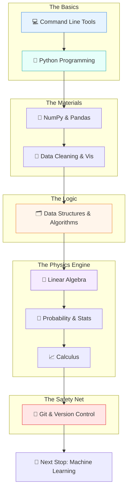

# 🚉 The Foundations Station: A Layman's Guide to AI Basics

Imagine you want to build a high-speed bullet train. You wouldn't start by choosing the fabric for the seats or painting the exterior. You'd start by laying solid steel tracks, building a powerful engine, and gathering the right raw materials. 

In the world of Artificial Intelligence, **Line 1: The Foundations Station** is exactly that. Before you can build self-driving cars or chatty AI assistants, you need to master the basic tools, organize your materials, and understand the underlying physics of how it all works.

---

## 📖 Table of Contents

* [1. The Journey Map](#1-the-journey-map)
* [2. The Tools of the Trade (Python & CLI)](#2-the-tools-of-the-trade-python--cli)
* [3. The Materials (Data Libraries & Visualization)](#3-the-materials-data-libraries--visualization)
* [4. The Warehouse Rules (Data Structures & Algorithms)](#4-the-warehouse-rules-data-structures--algorithms)
* [5. The Physics Engine (The Math)](#5-the-physics-engine-the-math)
* [6. The Safety Net (Git)](#6-the-safety-net-git)
* [7. Summary](#7-summary)

---

## 1. The Journey Map

Here is what your journey through the Foundations Station looks like. You can't skip ahead—each stop builds the track for the next!

---

## 2. The Tools of the Trade (Python & CLI)

Before you can build anything, you need to know how to use your hammer and workbench.

### 💻 Command Line Tools
Think of the Command Line as the **underground control room** of your computer. Instead of pointing and clicking on colorful icons (like a passenger), you type direct text commands to the machine (like a conductor). It is fast, powerful, and essential for moving around the AI factory.

### 🐍 Python Programming Basics
If AI had a universal spoken language, it would be Python. It’s a programming language that is incredibly easy to read—almost like plain English. It is the glue that holds everything in the AI world together, allowing you to tell the computer exactly what to do.

---

## 3. The Materials (Data Libraries & Visualization)

AI is completely useless without data. But raw data is messy.

### 🔢 NumPy & Pandas
Imagine you have a spreadsheet with a billion rows. Excel would crash instantly. **NumPy and Pandas** are like Excel on steroids. 
* **NumPy** handles heavy-duty number crunching (like a massive calculator).
* **Pandas** organizes your data into neat, manageable tables (like a super-powered filing cabinet).

### 🧹 Data Cleaning & Visualization
> [!WARNING]
> In AI, there is a golden rule: **Garbage In, Garbage Out**. If you train an AI on bad data, you get bad predictions.

**Data Cleaning** is the process of scrubbing your raw materials—fixing typos, filling in blanks, and throwing away trash. **Visualization** is taking all those boring numbers and turning them into pretty charts and graphs, so human eyes can actually understand what the data is saying.

---

## 4. The Warehouse Rules (Data Structures & Algorithms)

Imagine you own a warehouse with a million boxes. If you just throw them inside randomly, finding a specific box will take days. 

* **Data Structures** are the shelves and bins you use to organize the boxes (e.g., stacking them, lining them up, or linking them together).
* **Algorithms** are the step-by-step instruction manuals your forklift drivers use to find, sort, and move those boxes in the fastest way possible.

In programming, choosing the right structure and algorithm means the difference between a task taking one second versus taking one hundred years.

---

## 5. The Physics Engine (The Math)

AI might look like magic, but under the hood, it is just high-speed math. Don't panic! You don't need to be a mathematician, but you do need to understand the basic concepts.

### 📐 Linear Algebra for ML
Think of Linear Algebra as **how the computer sees the world**. A computer doesn't see a picture of a cat; it sees a giant grid of numbers (called a matrix) representing colors. Linear algebra gives us the rules for stretching, rotating, and squishing these grids of numbers.

### 🎲 Probability & Statistics
AI rarely deals in absolute certainties ("This is 100% a cat"). It deals in educated guesses ("I am 95% sure this is a cat, and 5% sure it's a fluffy pillow"). **Probability and Statistics** allow the AI to weigh evidence, measure uncertainty, and make smart decisions based on past experience.

### 📈 Calculus for Optimization
Imagine you are blindfolded on a mountain and want to get to the very bottom. You’d feel the slope of the ground with your feet and take a step downward. **Calculus** allows the AI to feel the "slope" of its own mistakes and mathematically step toward the optimal, most accurate solution.

---

## 6. The Safety Net (Git)

### 🐙 Git & Version Control
Have you ever worked on a document and saved it as `Final.doc`, then `Final_v2.doc`, then `Final_For_Real_This_Time.doc`? 

**Git** solves this nightmare. It is a "time machine" for your code. Every time you make a change, you take a snapshot. If you accidentally break your AI project, you don't panic—you just hit the ultimate undo button and roll back to a version that worked.

---

## 7. Summary

The **Foundations Station** isn't about building the flashy robots; it is about acquiring the essential skills you need to survive in the AI landscape. 

By mastering your tools (Python, CLI), organizing your workspace (Data Structures, Pandas), understanding the physics (Math), and wearing a hard hat (Git), you are fully prepared to leave the station and enter the world of true Machine Learning.
