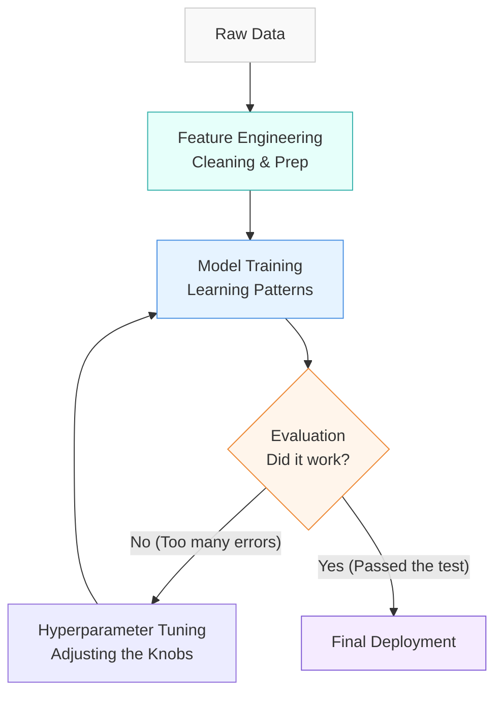

# 🚂 Line 2 - Machine Learning Loop: A Layman's Guide

Imagine you're hiring a new detective for your precinct. You don't just hand them a badge on day one and say, "Go solve crimes." Instead, you send them to the academy. You give them practice cases, teach them what clues to look for, test them on their deductive skills, and correct them when they get it wrong. Eventually, they learn the patterns of criminal behavior.

This is exactly what the **Machine Learning Loop** is. It's not magic; it's a structured training program for algorithms. You feed them data (past cases), they find patterns, you test them, and you tweak their "brain" until they get it right. 

---

## 📖 Table of Contents

* [1. The Machine Learning Loop Explained](#1-the-machine-learning-loop-explained)
* [2. The Teaching Styles: Supervised vs. Unsupervised](#2-the-teaching-styles-supervised-vs-unsupervised)
* [3. The Algorithms: Decision Trees & Random Forests](#3-the-algorithms-decision-trees--random-forests)
* [4. The Assembly Line: Scikit-Learn Workflows & Feature Engineering](#4-the-assembly-line-scikit-learn-workflows--feature-engineering)
* [5. Advanced Teamwork: Ensemble Learning](#5-advanced-teamwork-ensemble-learning)
* [6. Quality Control: Tuning and Evaluation](#6-quality-control-tuning-and-evaluation)
* [7. Summary](#7-summary)

---

## 1. The Machine Learning Loop Explained

In the world of AI, the Machine Learning loop is an iterative process. You don't just build a model once; you train it, evaluate it, tweak it, and train it again.

---

## 2. The Teaching Styles: Supervised vs. Unsupervised

When you send your algorithm to school, you have to choose how it learns. 

### 🧑‍🏫 Supervised Learning (Learning with a Teacher)
You give the AI the data *and* the answers (labels). "Here is a picture of a cat, and here is a label that says 'cat'."
* **Classification:** Predicting a category. (Is this email 'Spam' or 'Not Spam'?)
* **Regression:** Predicting a continuous number. (Based on square footage, what is the 'Price' of this house?)

### 🕵️ Unsupervised Learning (Learning without a Teacher)
You give the AI a massive pile of data with no labels and say, "Find something interesting."
* **Clustering:** Grouping similar things together. (Looking at a million shopping receipts and grouping customers into "Bargain Hunters" and "Luxury Shoppers" without being told those categories exist.)
* **Dimensionality Reduction:** Simplifying complex data. (Taking a 50-page suspect file and summarizing it into a 1-page profile without losing the important details.)

---

## 3. The Algorithms: Decision Trees & Random Forests

How does the AI actually make decisions? Let's look at one of the most popular methods.

### 🌳 Decision Trees (Playing 20 Questions)
A Decision Tree makes predictions by asking a series of Yes/No questions, just like the game 20 Questions.
* "Does it have fur?" -> Yes.
* "Does it bark?" -> Yes.
-> It's a dog!

> [!WARNING]  
> A single Decision Tree has a major flaw: it tends to memorize the specific data it was trained on (overfitting) rather than learning general rules. It's like a student who memorizes the practice test but fails the real exam.

### 🌲 Random Forests (The Council of Trees)
To fix the flaw of a single tree, we plant a **Random Forest**. We create hundreds of different Decision Trees, give each one a slightly different piece of the data, and let them all vote on the final answer. The wisdom of the crowd almost always beats a single guesser!

---

## 4. The Assembly Line: Scikit-Learn Workflows & Feature Engineering

In Python, the industry standard tool for this is **Scikit-Learn**. It allows you to build a seamless pipeline.

Before the AI can learn, you have to prepare its study materials. This is called **Feature Engineering & Selection**.
* **Feature Engineering:** Creating new, helpful data points. If you have "Date of Birth," you might engineer a new feature called "Age," because "Age" is easier for the AI to understand.
* **Feature Selection:** Throwing away useless data. The AI doesn't need to know the customer's favorite color to predict if they will default on a mortgage. Throw it out!

---

## 5. Advanced Teamwork: Ensemble Learning

A Random Forest is just one example of **Ensemble Learning**—combining multiple weak models to create one super-model. There are two main flavors:

1. **Bagging (Parallel Teamwork):** Like a Random Forest. You build many independent models at the same time and average their votes. It's great for preventing the AI from jumping to wild conclusions.
2. **Boosting (Sequential Teamwork):** You build one model. It makes mistakes. You build a *second* model specifically designed to fix the mistakes of the first one. You build a third to fix the second's mistakes. It's a relay race of continuous improvement.

---

## 6. Quality Control: Tuning and Evaluation

How do you know if your detective is actually ready for the streets?

### 🔄 Cross-Validation Techniques
If you test a student on the exact same questions they used to study, they will get an A+, but they haven't really learned anything. **Cross-Validation** means splitting your data into chunks. You train the AI on chunk A and test it on chunk B. Then you train it on chunk B and test it on chunk A. This ensures the model works in all scenarios.

### 🎛️ Hyperparameter Tuning (Adjusting the Knobs)
Algorithms have internal settings (knobs) you can twist to make them perform better. 
* **GridSearch:** The brute-force method. You literally test every single possible combination of knob settings until you find the perfect one. It's thorough, but painfully slow.
* **RandomSearch:** You test a random selection of knob settings. It's much faster and often finds a "good enough" setting in a fraction of the time.

### 📊 Model Evaluation
Finally, you grade the model using specific metrics:
* **Confusion Matrix:** A simple table showing exactly where the AI got confused. It shows True Positives (caught a criminal), True Negatives (let an innocent go), False Positives (arrested an innocent), and False Negatives (let a criminal go).
* **ROC Curve & AUC (Area Under the Curve):** A graph showing how well the model separates the "good guys" from the "bad guys." A score of 0.5 means it's guessing randomly. A score of 1.0 means it's perfect.

---

## 7. Summary

The **Machine Learning Loop** is an assembly line for teaching algorithms. You start by prepping your data (Feature Engineering), choose how to teach (Supervised vs. Unsupervised), pick your brain structures (Trees, Forests, Ensembles), twist the dials until it's perfect (Hyperparameter Tuning), and give it a final exam (Cross-Validation and Confusion Matrices). 

Once it passes, your AI is ready to graduate from the academy and go out into the real world!
