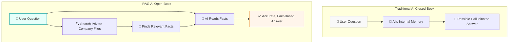

# 🚇 Line 5: The Applied AI Sector - A Layman's Guide

Imagine you've just invented the world's most powerful, state-of-the-art engine. It's an incredible feat of engineering, but right now, it's just sitting in a warehouse making noise. It doesn't become useful until you put it inside a car, a tractor, or an airplane. 

That is exactly what **Line 5 - The Applied AI Sector** is all about. 

If raw AI models (like GPT-4) are the engines, this sector is the assembly line where we build the vehicles. It is where we take the mathematical "brains" of Artificial Intelligence and turn them into tools you actually use in your everyday life, business, and industry.

---

## 📖 Table of Contents

* [1. Chatbots & RAG: Giving AI an Open-Book Test](#1-chatbots--rag-giving-ai-an-open-book-test)
* [2. AI Agents: From Talkers to Doers](#2-ai-agents-from-talkers-to-doers)
* [3. Recommender Systems: The Digital Matchmakers](#3-recommender-systems-the-digital-matchmakers)
* [4. Time Series Forecasting: Predicting the Future](#4-time-series-forecasting-predicting-the-future)
* [5. Voice Assistants & Speech Models: The Universal Translators](#5-voice-assistants--speech-models-the-universal-translators)
* [6. AI in the Real World: Healthcare, Finance, & Retail](#6-ai-in-the-real-world-healthcare-finance--retail)
* [7. Packaging it Up: APIs and Demos](#7-packaging-it-up-apis-and-demos)

---

## 1. Chatbots & RAG: Giving AI an Open-Book Test

Standard chatbots (like ChatGPT) rely on their internal memory—everything they learned during training. Asking them a question is like giving a student a **closed-book test**. If they don't know the answer, they might just make one up (which we call a "hallucination").

**RAG (Retrieval-Augmented Generation)** changes the game. It turns the chatbot into an **open-book test**. Before answering your question, the AI is allowed to "retrieve" (search) your specific, private documents (like company policies or medical records). It then reads those documents and "augments" its answer using only those facts.



---

## 2. AI Agents: From Talkers to Doers

Most AI just talks to you. But what if it could *do* things for you?

An **AI Agent** (using Agentic AI & Tool-Use Capabilities) is like a super-smart digital intern. Instead of just giving you instructions on how to book a flight, an AI agent is given a goal ("Book a flight to New York"), a budget, and access to **Tools** (like a web browser, a credit card, and a calendar). It can think, plan, and execute tasks completely autonomously.

```mermaid
graph LR
    User[🧑 User: "Schedule a meeting with Bob"] --> Agent[🤖 AI Agent]
    Agent -->|1. Thinks| Plan[📝 Plan: Check calendar, email Bob]
    Agent -->|2. Uses Tool| Cal[📅 Calendar App]
    Agent -->|3. Uses Tool| Email[📧 Email App]
    Email --> Success[✅ Meeting Scheduled!]
    
    style Agent fill:#e6f3ff,stroke:#4a90e2,stroke-width:2px
```

---

## 3. Recommender Systems: The Digital Matchmakers

Every time Netflix suggests a movie or Amazon suggests a product, you are interacting with a Recommender System. They generally work in two ways:

1. **Content-Based (The Librarian):** If you check out a book about dragons, the librarian says, "Here is another book about dragons." It recommends items that are similar to what you already like.
2. **Collaborative Filtering (The Gossipy Friend):** Your friend says, "Hey, Bob has the exact same taste in movies as you do, and he *loved* this new sci-fi flick. You should watch it!" It recommends things based on what similar people liked.

---

## 4. Time Series Forecasting: Predicting the Future

Think of Time Series Forecasting (using algorithms like **ARIMA** or **LSTM**) as weather forecasting for businesses. 

If a store sold 100 coats in October, 200 in November, and 300 in December for the past five years, the AI looks at that sequence of events over time (the "time series") and predicts how many they will sell next year. This is how companies know exactly how much inventory to stock before a big holiday.

---

## 5. Voice Assistants & Speech Models: The Universal Translators

When you say "Hey Siri" or use a smart speaker, you are interacting with Voice AI. These models do three complex things in a fraction of a second:
1. **Speech-to-Text (Hearing):** Turns your sound waves into written words.
2. **LLM (Thinking):** Figures out what those words actually mean.
3. **Text-to-Speech (Speaking):** Generates a robotic, but human-sounding, voice to reply back to you.

---

## 6. AI in the Real World: Healthcare, Finance, & Retail

When we apply these technologies to massive industries, the results are life-changing:

* 🏥 **Healthcare:** AI acts as a super-powered diagnostic assistant, looking at thousands of X-rays to spot microscopic anomalies a human doctor might miss when tired.
* 💳 **Finance:** AI acts as an invisible security guard. It monitors millions of credit card swipes per second, instantly freezing a card if someone tries to buy a TV in a country you've never visited.
* 🛒 **Retail:** AI powers smart supply chains, ensuring that the exact pair of shoes you want is in stock at your local store exactly when you want to buy them.

---

## 7. Packaging it Up: APIs and Demos

An AI model living on a supercomputer is useless if an app on your phone can't talk to it. 

* **ML APIs & Wrappers (FastAPI, Flask):** Think of an API like a restaurant drive-thru window. Your app pulls up, hands over some data (the order), and the AI inside the kitchen cooks up an answer and passes it back through the window. FastAPI and Flask are the tools developers use to build these drive-thru windows.
* **Demos (Streamlit, Gradio, Dash):** If you build a cool AI, you want to show it off without making people read code. These tools are like instant showrooms. They let a developer turn a complicated AI model into a beautiful, clickable web page in a matter of minutes.

---

### 🚀 Conclusion

The Applied AI Sector is where science fiction becomes everyday reality. By wrapping intelligent models in tools, agents, and user-friendly interfaces, we turn abstract math into the digital assistants, personalized recommendations, and smart industries that power the modern world.
