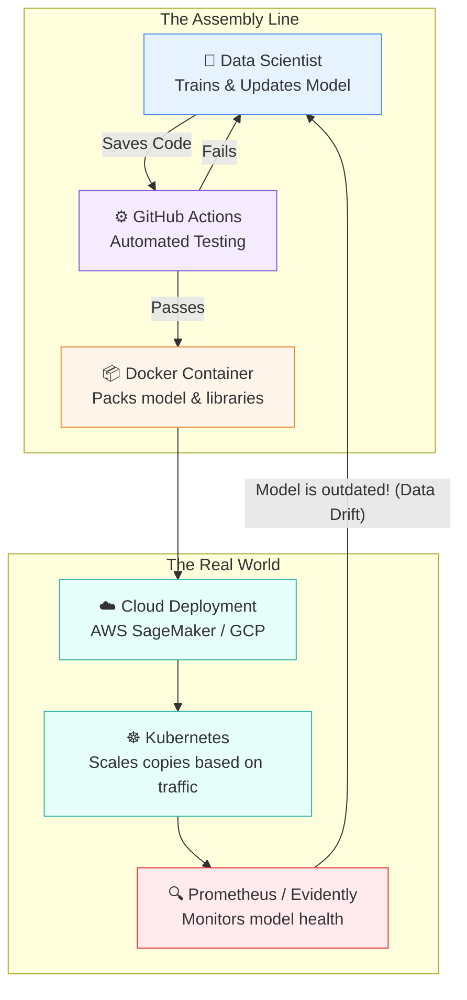

# 🚢 The Shipping & Logistics Route: A Layman's Guide to AI Tooling & Deployment

Imagine you have just baked the world's most delicious cake in your home kitchen (this is your AI model). It tastes perfect. But a cake sitting on your counter doesn't help anyone else. To turn this into a business, you need to package the cake so it doesn't get smashed in transit, put it on a delivery truck, ensure it stays fresh on the shelf, and figure out how to bake 10,000 cakes a day when demand spikes. 

**Line 6 of the AI Metro Map — Tooling & Deployment** is the logistics network of the AI world. It is the set of tools and practices that get your AI out of the laboratory and into the hands of real users safely, reliably, and at scale.

---

## 📖 Table of Contents

* [1. Docker for Model Containers: The Tupperware of Software](#1-docker-for-model-containers-the-tupperware-of-software)
* [2. MLOps Fundamentals: The Automated Assembly Line](#2-mlops-fundamentals-the-automated-assembly-line)
* [3. Cloud Deployment: Renting the Mega-Mall](#3-cloud-deployment-renting-the-mega-mall)
* [4. Kubernetes & Model Scaling: The Fleet Manager](#4-kubernetes-model-scaling-the-fleet-manager)
* [5. Model Monitoring Tools: The Health Inspectors](#5-model-monitoring-tools-the-health-inspectors)
* [6. ONNX & Model Portability: The Universal Translator](#6-onnx-model-portability-the-universal-translator)
* [7. Promptflow & Automated Testing: Quality Assurance](#7-promptflow-automated-testing-quality-assurance)
* [8. The Full Logistics Diagram](#8-the-full-logistics-diagram)

---

## 1. Docker for Model Containers: The Tupperware of Software

Have you ever tried to run a piece of software and gotten an error like, "Missing XYZ library"? It's the equivalent of giving a friend your cake recipe, but they don't have the right brand of flour, so it tastes terrible.

**Docker** solves this by acting like super-advanced Tupperware. When you put your AI model into a "Docker Container," you are packing the model *and* the exact version of every ingredient (software library) it needs. 

> [!TIP]
> If a Docker container works on your laptop, it is guaranteed to work on your friend's laptop, and it is guaranteed to work on a massive supercomputer. It is a sealed, perfect environment.

---

## 2. MLOps Fundamentals: The Automated Assembly Line

**MLOps** stands for Machine Learning Operations. It's like the conveyor belt in a factory.

Normally, moving a model from the lab to the real world takes a lot of manual clicks and commands. **CI/CD (Continuous Integration / Continuous Deployment)** uses tools like **GitHub Actions** to automate everything. 

When a developer finishes an update to the AI, they press "save." GitHub Actions automatically grabs the code, runs a series of tests to make sure it isn't broken, packs it into a Docker container, and ships it to the internet. If a test fails, the conveyor belt stops, and the developer gets an alert.

---

## 3. Cloud Deployment: Renting the Mega-Mall

Once your AI is packed and ready, where does it live? You could buy a bunch of expensive computers and put them in your closet, but that's a hassle.

Instead, you use **Cloud Deployment** platforms like **AWS SageMaker** or **GCP Vertex AI**. Think of these as mega-malls where you rent a storefront for your AI. They provide the electricity, security, and computing power (servers). You just provide the AI, and they handle the heavy lifting of keeping it online 24/7.

---

## 4. Kubernetes & Model Scaling: The Fleet Manager

Let's say your AI goes viral overnight. Suddenly, a million people want to use it. A single server will crash under the pressure.

**Kubernetes** is like an intelligent fleet manager for delivery trucks. 
* If demand is low, it tells most of the trucks (servers) to turn off to save you money. 
* If there is a massive spike in traffic, Kubernetes automatically spawns hundreds of new copies of your Docker container in seconds to handle the load.
* If one server breaks down and catches fire, Kubernetes seamlessly routes traffic away from it and starts a replacement.

---

## 5. Model Monitoring Tools: The Health Inspectors

AI models are like fresh produce—they can go bad over time. If you train an AI to predict housing prices in 2020, and try to use it in 2026, its predictions will be terribly wrong because the world has changed. This is called **"Data Drift."**

Tools like **Evidently** and **Prometheus** act as health inspectors. They constantly monitor the AI's predictions in the real world. If the AI starts making weird mistakes or taking too long to answer, these tools sound an alarm so you can retrain the model with fresh data.

---

## 6. ONNX & Model Portability: The Universal Translator

Imagine you buy a DVD in the US, but it won't play on a European DVD player. Hardware can be just as annoying. An AI trained on an Nvidia graphics card might struggle to run on an Apple chip or a smartphone.

**ONNX (Open Neural Network Exchange)** is the universal translator. It allows you to take an AI built with one set of tools (like PyTorch) and convert it into a standard format. Once it's in the ONNX format, it can run efficiently on almost any hardware—from massive cloud servers to the chip inside a smart refrigerator.

---

## 7. Promptflow & Automated Testing: Quality Assurance

When building apps powered by large language models (like ChatGPT), testing is tricky. How do you test if an AI is writing a "good" poem or giving "helpful" customer service? 

**Promptflow** and similar tools act as the Quality Assurance team. They allow you to build automated tests for your prompts. You can feed the AI hundreds of test scenarios and use automated judges to score the quality of the answers. It ensures that when you tweak the AI's instructions, you aren't accidentally making it give worse advice.

---

## 8. The Full Logistics Diagram

Here is how all these pieces fit together to create a smooth, automated pipeline:

### Summary
Without **Line 6 (Tooling & Deployment)**, AI is just a cool science experiment sitting on a researcher's laptop. By using Tupperware-like containers (Docker), automated factories (MLOps), and smart fleet managers (Kubernetes), you can deliver robust, scalable AI to millions of users around the globe.
