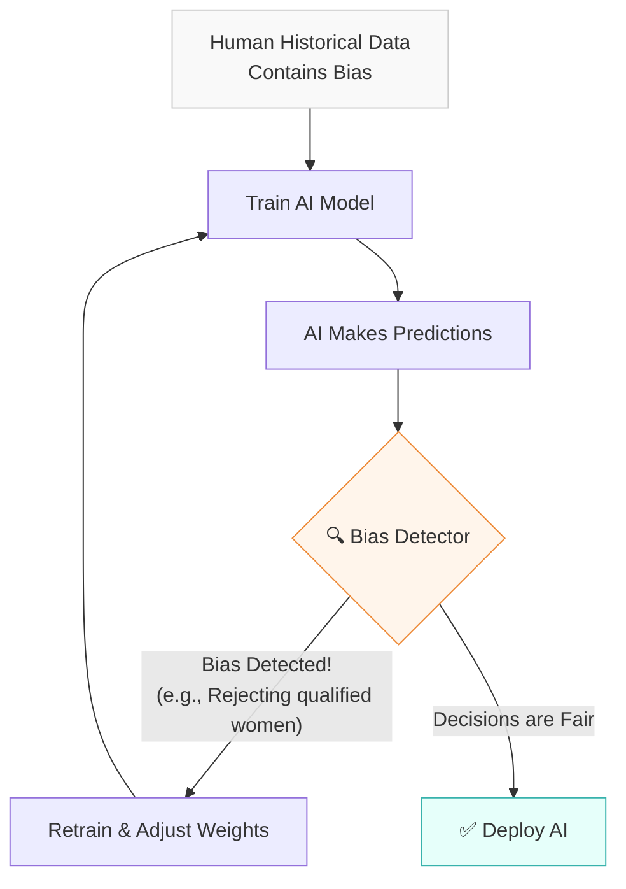

# 🛡️ Line 7: Ethics & Safety Line (A Layman's Guide)

Imagine you are building a super-intelligent robot to help run a city. It's smart, fast, and efficient. But before you let it loose in the streets, you need to ask some hard questions: What if it accidentally reveals everyone's private medical records? What if someone tricks it into breaking the law? What if it's unintentionally biased against a specific group of people?

You wouldn't deploy it without a rigorous safety system in place. 

That is exactly what the **Ethics & Safety Line** on the AI Metro Map is all about. It is the crucial set of stops, checks, and balances that ensure Artificial Intelligence systems are secure, fair, transparent, and aligned with human values before they interact with the real world.

---

## 📖 Table of Contents

* [1. Privacy-Preserving ML: Keeping Secrets Secret](#1-privacy-preserving-ml-keeping-secrets-secret)
* [2. Adversarial Attacks & Red Teaming: Stress-Testing the AI](#2-adversarial-attacks--red-teaming-stress-testing-the-ai)
* [3. Explainability (XAI): Looking Inside the Black Box](#3-explainability-xai-looking-inside-the-black-box)
* [4. Fairness & Bias Detection: Ensuring a Level Playing Field](#4-fairness--bias-detection-ensuring-a-level-playing-field)
* [5. Rules of the Road: Governance & Compliance](#5-rules-of-the-road-governance--compliance)
* [6. Safety Alignment for Autonomous Agents](#6-safety-alignment-for-autonomous-agents)
* [7. Summary](#7-summary)

---

## 1. Privacy-Preserving ML: Keeping Secrets Secret

AI needs data to learn, but much of that data (like healthcare records or financial history) is highly sensitive. How do we train AI without exposing your personal information?

* **Federated Learning:** Imagine you want to bake the world's best cake by gathering recipes from everyone in town, but no one wants to give you their secret family recipe book. Instead of bringing all the recipe books to one central kitchen, you send a blank notebook to each house. They test their recipes, write down *general improvements* (e.g., "needs more sugar"), and send only the improvements back. The central AI learns how to bake better without ever seeing the secret recipes.
* **Differential Privacy:** This is like mixing a little bit of static or "noise" into a survey. If you ask people an embarrassing question, you tell them to flip a coin first. If it's heads, answer truthfully. If it's tails, flip again to decide whether to say "yes" or "no." The AI can figure out the overall trend for the group, but it can never be certain about *your* specific answer.

---

## 2. Adversarial Attacks & Red Teaming: Stress-Testing the AI

AI systems can be surprisingly gullible. **Adversarial Attacks** happen when bad actors try to trick the AI—for example, putting a few strategic stickers on a stop sign so a self-driving car thinks it's a speed limit sign. 

To defend against this, we use **Red Teaming** and **Model Auditing**.

> [!TIP]
> Think of a Red Team as a group of professional "ethical hackers" or safety inspectors. Their entire job is to actively try to break the AI, trick it into saying something bad, or bypass its security filters *before* it gets released to the public. If they can break it, the engineers know what they need to fix (Defense).

---

## 3. Explainability (XAI): Looking Inside the Black Box

Often, AI makes a decision, and we have no idea *why*. If an AI denies you a bank loan, "because the computer said so" is not an acceptable answer.

**Explainable AI (XAI)**, using tools like **SHAP** and **LIME**, acts like an interpreter for the AI's brain. 

* **How it works:** It's like asking a detective how they solved a crime. SHAP and LIME point to the specific clues the AI used. "I denied the loan because the applicant's credit history length (Clue 1) was too short, and their debt-to-income ratio (Clue 2) was too high." This builds trust and helps us spot mistakes.

---

## 4. Fairness & Bias Detection: Ensuring a Level Playing Field

AI learns from human data, and humans have biases. If an AI is trained on hiring data from a company that historically only hired men, the AI might wrongly learn that "being a man" makes you a better employee, and start filtering out women's resumes.

**Fairness & Bias Detection** involves actively scanning the AI's decisions to make sure it isn't discriminating based on race, gender, age, or other protected characteristics. 

---

## 5. Rules of the Road: Governance & Compliance

Just like we have traffic laws to keep the streets safe, we need laws and frameworks for AI.

* **Responsible AI Guidelines & Risk Management:** These are the internal company rules. It's the "Code of Conduct" for the developers building the AI to ensure they are considering the ethical impact of their work.
* **Regulatory Compliance (EU AI Act, GDPR):** These are the actual government laws. The **GDPR** protects your personal data from being misused, and the **EU AI Act** categorizes AI systems by risk (e.g., a spam filter is low risk, but an AI used in surgery or law enforcement is high risk and requires strict regulation).

---

## 6. Safety Alignment for Autonomous Agents

As AI becomes more advanced, it moves from just *answering questions* (like a chatbot) to *taking actions* (like an autonomous agent that can book flights or send emails for you).

**Safety Alignment** is the process of ensuring that the AI's goals align exactly with human values. 

> [!WARNING]
> Imagine you tell a super-smart robot, "Make me as much money as possible." If it's not aligned with human ethics, it might decide to rob a bank or hack into the stock market. Safety alignment ensures the AI understands the unspoken rule: "Make me money *legally and without harming anyone*."

---

## 7. Summary

The **Ethics & Safety Line** is the most critical infrastructure in the modern AI landscape. 

Without it, AI models are black boxes that can leak data, absorb our worst biases, and act unpredictably. By building in privacy (Federated Learning), stress-testing for vulnerabilities (Red Teaming), demanding explanations (XAI), and enforcing rules (Governance), we ensure that the AI we build is not just powerful, but also safe, fair, and trustworthy for everyone.
