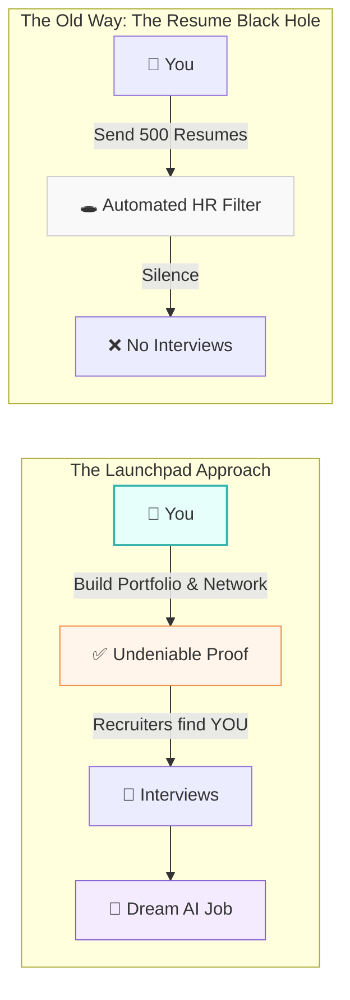

# 🚀 The Launchpad: A Layman's Guide to Your AI Career

Imagine you are an astronaut preparing for a mission to Mars. You don't just put on a spacesuit, walk into NASA, and say, "I'm ready, put me in the rocket." (Spoiler alert: security will escort you out).

Instead, you need a proven track record, rigorous training, a visible profile, and a network of professionals who trust you. 

That is exactly what the **Career Launchpad** is for an AI professional. It's the strategic process of proving your skills, getting noticed, and successfully launching yourself into the AI industry.

---

## 📖 Table of Contents

* [1. What is the Career Launchpad?](#1-what-is-the-career-launchpad)
* [2. Building the Rocket: Portfolio & Open Source](#2-building-the-rocket-portfolio--open-source)
* [3. The Proving Grounds: Kaggle & Certifications](#3-the-proving-grounds-kaggle--certifications)
* [4. The Press Release: Resume & LinkedIn](#4-the-press-release-resume--linkedin)
* [5. Astronaut Training: Interviews & Networking](#5-astronaut-training-interviews--networking)
* [6. Launching Payloads: Freelancing & SaaS](#6-launching-payloads-freelancing--saas)
* [7. Summary](#7-summary)

---

## 1. What is the Career Launchpad?

Most people think getting an AI job is about taking one online course and applying to 500 jobs online. (Which means your resume usually ends up in a black hole).

The **Career Launchpad** is a multi-stage approach where you build undeniable proof of your skills. You don't just *say* you know AI; you *show* it.

---

## 2. Building the Rocket: Portfolio & Open Source

You need a tangible ship to show investors. In AI, this is your **Portfolio Building (GitHub + Blog)**.

* **GitHub:** Your code repository. If a recruiter or hiring manager wants to see if you can actually code, they look here.
* **Blog:** Writing about what you build. If you can explain complex AI concepts simply, you instantly stand out.

> [!TIP]
> Think of GitHub as your kitchen and the Blog as your menu. The kitchen shows you know how to cook; the menu shows people why they should eat there.

**Contribute to Open Source Projects:** Instead of just building your own small projects, help fix the big ones! Contributing to public AI projects shows you can work on a team, read other people's code, and add real value. 

---

## 3. The Proving Grounds: Kaggle & Certifications

Before anyone lets you fly a real rocket, they want to see you in the simulator.

* **Kaggle Competitions & Leaderboards:** Kaggle is the ultimate proving ground for Data Science and Machine Learning. Companies post real problems, and you compete to solve them. Having a high rank on Kaggle is like having a gold medal in the AI Olympics.
* **AI Certifications & MOOCs:** Massive Open Online Courses (MOOCs) and official certifications (like AWS Machine Learning or DeepLearning.AI) act as your formal ground school. They give you the foundational knowledge and the official stamp of approval.

---

## 4. The Press Release: Resume & LinkedIn Optimization

If you build the best rocket in the world but hide it in a barn, no one will care. 

* **Resume & LinkedIn Optimization:** Your resume and LinkedIn profile are your marketing materials. They should clearly state what you have built, the impact it had (use numbers!), and the technologies you used. 
* Turn your LinkedIn into a landing page for your career. Post about your Kaggle wins, share your blog posts, and highlight your open-source contributions.

---

## 5. Astronaut Training: Interviews & Networking

Getting the interview is only half the battle. Now you have to pass the tests and know the right people.

* **Technical Interview Prep (ML + System Design):** AI interviews are tough. You need to know both Machine Learning theory (how the algorithms work) and System Design (how to build an app that can handle a million users). 
* **Networking (Discord, X, LinkedIn AI Groups):** Mission control! The best AI jobs are rarely posted on public job boards; they are shared in private groups. Be active in Discord communities, follow researchers on X (Twitter), and engage in LinkedIn AI groups. 

> [!NOTE]
> Networking isn't about begging for jobs. It's about showing up, sharing your work, and helping others. When a hiring manager has an open role, they will think of the helpful person they interact with every day.

---

## 6. Launching Payloads: Freelancing & SaaS

You don't have to wait for a traditional employer to start your career. You can launch your own missions right now.

* **AI Freelancing Platforms (Upwork, Toptal):** Offer your skills on platforms where businesses are actively looking for AI talent. It builds your portfolio and pays the bills while you hunt for a full-time role.
* **Build Your AI SaaS Product:** (Software as a Service). Find a small problem, build an AI tool to solve it, and charge people a few bucks a month to use it. Even if it fails, the experience of building a full end-to-end AI product is the best resume booster in the world.

---

## 7. Summary

The **Career Launchpad** is about taking control of your destiny in the AI industry. 

Instead of waiting to be picked from a stack of 1,000 resumes, you are proactively building your portfolio, proving your skills in competitions, networking with the right people, and maybe even launching your own AI businesses. 

It takes time to build the rocket, but once you do, the sky isn't the limit—it's just the beginning. 
