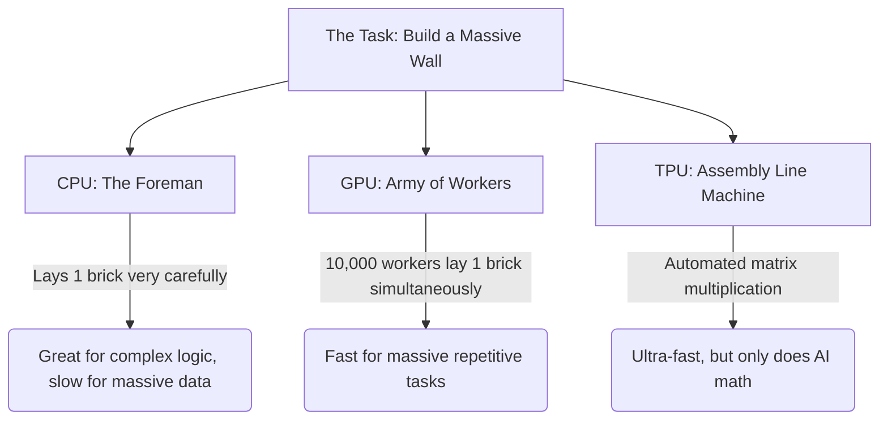
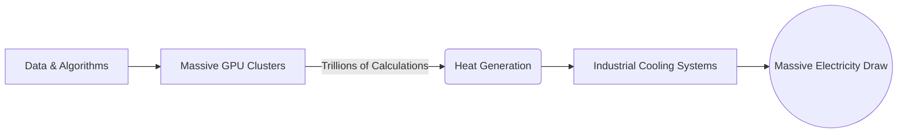

# 🚉 Line 9: Hardware & Compute Infrastructure (The Power Grid)

Welcome to **Line 9**! Imagine building a sprawling, ultra-modern city. You have the brilliant blueprints (Algorithms) and endless building materials (Data), but none of it matters without the heavy machinery and a massive power grid to actually construct the skyscrapers. 

In the AI world, this "heavy machinery" is the physical hardware—the microchips, servers, and cooling systems—that crunches the numbers. Let's take a tour of the engines that make modern AI possible.

## 🏗️ CPUs, GPUs, and TPUs: The Construction Crew

To understand how AI is processed, let's look at the different types of computer chips as members of a construction crew.

- **CPU (Central Processing Unit) - *The Foreman*:** The CPU is the brain of your everyday computer. It is incredibly smart and can handle highly complex, logical tasks, but it tackles them sequentially (one by one). If you ask a CPU to build a wall, the foreman will carefully lay one brick at a time. It's perfect for running your operating system, but too slow for massive AI tasks.
- **GPU (Graphics Processing Unit) - *The Army of Workers*:** Originally designed for rendering video games (calculating thousands of pixels at once), GPUs are composed of thousands of smaller, simpler cores. If you ask a GPU to build a wall, it’s like hiring 10,000 workers who each lay a single brick at the exact same time. AI relies heavily on this **parallel processing**.
- **TPU (Tensor Processing Unit) - *The Custom Assembly Line*:** Created specifically by Google, TPUs are custom-built factory machines designed to do exactly one thing: AI math (tensor operations). They can't run a video game or a web browser, but they can crunch AI data faster and more efficiently than almost anything else.

## 🗣️ What is CUDA? (The Universal Translator)

Having an army of 10,000 workers (the GPU) is great, but how do you give them instructions so they don't bump into each other? 

Enter **CUDA** (Compute Unified Device Architecture). Created by NVIDIA, CUDA is essentially the megaphone and universal language that allows software engineers to easily write programs that control the massive army of GPU workers. Before CUDA, using a GPU for non-graphics tasks was like trying to write a novel using a paintbrush. CUDA made GPUs accessible for general mathematical tasks, sparking the modern AI revolution.

## 🗄️ VRAM (Video RAM): The Workers' Workbench

When you run an AI model, the data has to sit somewhere immediately accessible to the GPU. This is **VRAM (Video Random Access Memory)**. 

Think of VRAM as a **workbench**. 
- The GPU workers are standing at the workbench. 
- If the workbench is small (low VRAM), the workers can only hold a small AI model. If they need more data, they have to walk all the way to the warehouse (your computer's main storage), slowing everything down to a crawl.
- If the workbench is massive (high VRAM, like 24GB or 80GB), the workers can keep giant models (like a Large Language Model) right in front of them, processing everything at lightning speed. 
*This is why AI enthusiasts and researchers are always obsessing over how much VRAM a graphics card has!*

## ⚡ The Power Grid: Why AI Uses So Much Electricity

You might have read that training AI models requires as much electricity as a small town. Why? 

Because "training AI" is fundamentally just doing billions of mathematical calculations per second, for months on end. Every time a microchip flips a digital switch to perform a calculation, it uses a tiny amount of electricity and generates a tiny puff of heat. 

Multiply that tiny amount of heat by trillions of operations happening inside tens of thousands of GPUs wired together. Suddenly, you aren't just plugging a computer into the wall; you are plugging into industrial power substations. 

## 🏢 The Physical Reality of AI Servers

When we say "The Cloud," it sounds soft and ethereal. The physical reality of AI is anything but. 

If you walk into a modern AI data center, you won't find a quiet room. You will find:
- **Deafening Noise:** Row after row of jet-engine-loud server racks, packed with heavy-duty fans trying to blast heat away from the GPUs.
- **Liquid Cooling:** In the newest data centers, air cooling isn't enough. They pump chilled liquid directly over the chips just to keep them from melting their own circuitry.
- **Thick Cables:** The GPUs need to talk to each other to solve problems together. The data centers are laced with miles of fiber-optic cables, passing data back and forth at blistering speeds.

Next time you chat with an AI and get an instant response, remember: somewhere in the world, a massive, roaring engine of silicon, copper, and electricity just spun up to craft that answer for you. 
