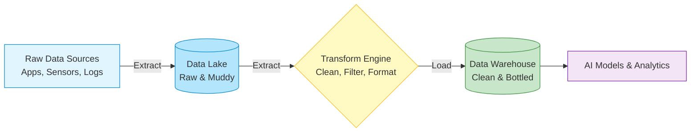
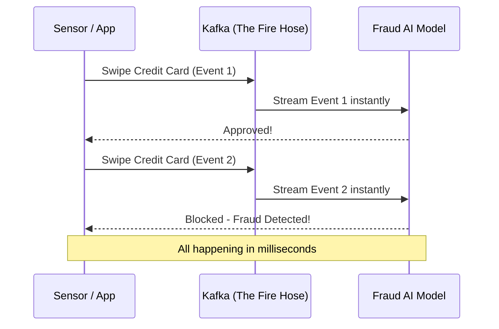

# Line 10: Data Engineering & Pipelines (The Water Supply)

Imagine a bustling city. Before anyone can turn on a tap and get a glass of clean drinking water, a massive, hidden infrastructure has to work perfectly. Water must be collected from lakes, pumped through underground pipes, filtered at a treatment plant, and stored in reservoirs before it finally reaches your home.

In the world of AI, **Data Engineering** is that hidden infrastructure. AI models are incredibly thirsty, but they can't just drink raw data from anywhere. They need massive amounts of clean, organized data to learn and function properly. Data Engineers are the plumbers and civil engineers of the AI world—they build the systems that gather, clean, and deliver the data.

Let's explore the key stops on Line 10: The Data Engineering Pipeline.

## Stop 1: Gathering Massive Datasets (The Catchment Area)

Before you can purify water, you have to collect it. In AI, this means gathering data from everywhere: websites, sensors, mobile apps, databases, and system logs. This is like rain falling into a catchment area.

**The Challenge:** The sheer volume is staggering. We aren't talking about a few spreadsheets; we're talking about petabytes of information (millions of gigabytes) flowing in constantly. Systems must be built to catch all this "rain" without overflowing, crashing, or losing a single drop.

## Stop 2: The Data Lake vs. The Data Warehouse (The Reservoirs)

Once you've collected the data, where do you put it? You have two main choices, and they serve very different purposes.

### The Data Lake (The Natural Reservoir)
A Data Lake is like a massive, natural lake. All the water (data) flows in exactly as it is—raw, unfiltered, and unstructured. You might have text documents, images, video files, and random sensor readings all mixed together in one giant pool.
*   **Pros:** It can hold *anything* and holds an infinite amount. It's cheap, flexible, and great for hoarding data you might need later.
*   **Cons:** It’s muddy. If you want a clean glass of water (a specific, reliable answer), you have to do a lot of filtering yourself.

### The Data Warehouse (The Bottled Water Facility)
A Data Warehouse is highly structured, like a warehouse full of bottled water, perfectly labeled and organized on shelves. The data here has already been cleaned, processed, and categorized.
*   **Pros:** It's incredibly fast to find exactly what you need. The "water" is ready to drink (or ready for an AI to analyze).
*   **Cons:** It's expensive to maintain, and you have to know exactly how you want to organize things *before* you put them in.

## Stop 3: SQL vs. NoSQL (How We Organize the Bottles)

When you store data, you need a system for organizing and retrieving it. 

### SQL (Structured Query Language) - The Spreadsheet Approach
Imagine a massive Excel spreadsheet where every column has a strict rule (e.g., Column A must be a "Name", Column B must be a "Number"). SQL databases are exactly like this. They are incredibly strict, reliable, and great when data fits neatly into rows and columns (like bank transactions or flight bookings).

### NoSQL (Not Only SQL) - The Filing Cabinet Approach
Imagine a giant filing cabinet where you can throw in a text document, a photo, and a messy list of user preferences into the same folder. NoSQL databases are flexible and don't force you into strict columns. They are perfect for unstructured data or when the shape of your data is constantly changing (like social media posts).

## Stop 4: The ETL Pipeline (The Water Treatment Plant)

Raw data scooped directly out of a Data Lake is rarely ready for an AI to consume. It might have spelling errors, duplicate records, or missing pieces. This is where **ETL** pipelines come in.

*   **E - Extract:** Pull the raw, muddy water out of the Data Lake.
*   **T - Transform:** Filter the water. Remove the dirt (errors), add chlorine (standardize formats), and make it pure.
*   **L - Load:** Pump the clean water into the Data Warehouse or directly to the AI model.

## Stop 5: Real-Time Streaming (The High-Pressure Fire Hose)

Sometimes, waiting for a nightly ETL process to clean the data is too slow. If you are tracking credit card fraud, monitoring a self-driving car, or recommending a video on TikTok, you need the data *right now*.

This is where **Real-Time Streaming** (using tools like Apache Kafka) comes in.

Instead of gathering water in a bucket and carrying it to the plant once a day (batch processing), Kafka acts like a massive, high-pressure fire hose. It handles millions of events per second, piping data directly from the source to the AI model instantly, without skipping a beat.

## Summary
Without Data Engineers laying the pipes, building the reservoirs, and operating the treatment plants, the brilliant AI models at the end of the line would have nothing to drink. Data engineering is the unsung hero that ensures data flows cleanly, quickly, and reliably to power the AI revolution.
