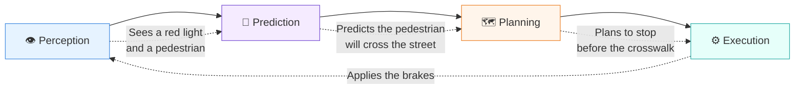

# 🤖 Line 11: Embodied AI & Robotics (The Physical World) - A Layman's Guide

Imagine an AI today as an incredibly smart person locked inside a computer screen. They can write you a poem, beat you at chess, and ace a bar exam. But if you ask them to pour you a cup of coffee or fold your laundry? They can't do it. They don't have hands.

**Embodied AI** is what happens when we give AI a physical body—like a robotic arm, a self-driving car, or a drone—and let it interact with the messy, unpredictable real world. It is the bridge between digital intelligence and physical movement.

---

## 📖 Table of Contents

* [1. Reinforcement Learning: The Toddler Approach](#1-reinforcement-learning-the-toddler-approach)
* [2. Robotics: Brains Meet Brawn](#2-robotics-brains-meet-brawn)
* [3. Self-Driving Cars: The Mechanics of Autonomy](#3-self-driving-cars-the-mechanics-of-autonomy)
* [4. Drones: AI Takes Flight](#4-drones-ai-takes-flight)
* [5. Summary](#5-summary)

---

## 1. Reinforcement Learning: The Toddler Approach

How do you teach a robot to walk? You don't write a million lines of code telling it exactly how to move every single gear and motor. The real world is too unpredictable for that. Instead, you use **Reinforcement Learning**.

Imagine a toddler learning to walk. They take a step, fall down, and get a little scrape (a negative reward or "penalty"). They adjust their balance, try again, and manage to take three steps before you clap and cheer (a positive reward). Eventually, through pure trial and error, they figure out the mechanics of walking.

Reinforcement Learning works exactly the same way for AI. 

```mermaid
graph TD
    subgraph Reinforcement Learning Loop
        direction TB
        Agent[🤖 AI Brain] -->|Takes an action<br/>(e.g., moves a leg)| World[🌍 The Physical World]
        World -->|Updates State<br/>(e.g., robot fell over)| Agent
        World -.->|Reward / Penalty<br/>(e.g., -1 point for falling, +10 for stepping)| Agent
    end
    
    style Agent fill:#e6fffa,stroke:#38b2ac,stroke-width:2px
    style World fill:#fff5eb,stroke:#ed8936
```

> [!TIP]
> Think of it like practicing free throws in basketball. You shoot the ball (trial), see if it goes in or misses (feedback), and adjust your aim for the next shot (learning) until you get nothing but net!

---

## 2. Robotics: Brains Meet Brawn

Translating digital intelligence into physical movement is incredibly hard. When a chatbot makes a mistake, it outputs a weird sentence. When a 200-pound robot makes a mistake, it punches a hole in your drywall.

Robotics requires combining the "brain" (AI) with the "brawn" (hardware):

1. **Sensors (The Senses):** Cameras, lasers (LiDAR), and microphones tell the robot where it is and what is around it.
2. **Actuators (The Muscles):** The physical motors and hydraulics that move the robot's joints.
3. **The AI (The Brain):** Takes the sensor data, makes a split-second decision, and sends electrical signals to the muscles to move.

---

## 3. Self-Driving Cars: The Mechanics of Autonomy

Self-driving cars are essentially giant robots that you sit inside. They use Embodied AI to navigate chaotic roads safely. 

Because driving requires constant attention, the car's AI operates in a continuous, high-speed loop:



A self-driving car doesn't just react; it anticipates. It loops through this process dozens of times per second to predict what unpredictable human drivers and pedestrians might do next.

---

## 4. Drones: AI Takes Flight

Drones are taking Embodied AI to the skies. Instead of just being remote-controlled toys steered by a human pilot, AI-powered drones can think for themselves.

Because they operate in 3D space, the AI has to think up, down, left, right, forwards, and backwards all at once! This allows them to:
* **Avoid Obstacles:** Weaving through dense forests or dodging power lines at high speeds.
* **Track Targets:** Following a snowboarder down a mountain to frame the perfect camera shot without crashing.
* **Deliver Packages:** Navigating unpredictable winds and curious birds to drop off your online order safely on your porch.

---

## 5. Summary

**Line 11 - Embodied AI & Robotics** is where AI escapes the computer screen and enters our physical reality. 

By using **Reinforcement Learning** (trial and error), AI learns how to control physical bodies. Whether it is a robotic arm folding your clothes, a self-driving car navigating rush-hour traffic, or a drone delivering a package, translating digital smarts into physical action is the next great frontier. 

We are moving from AI that just *thinks*, to AI that *does*.
