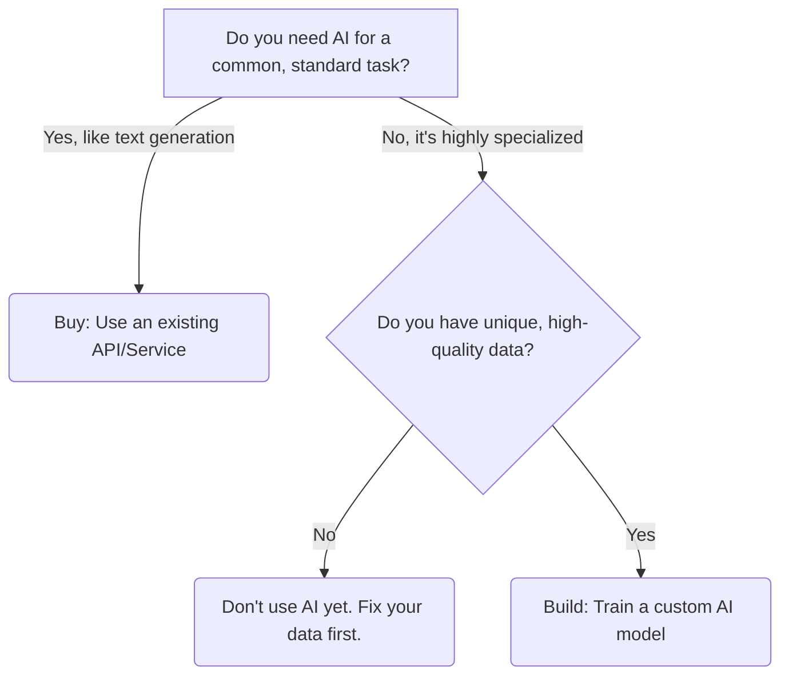
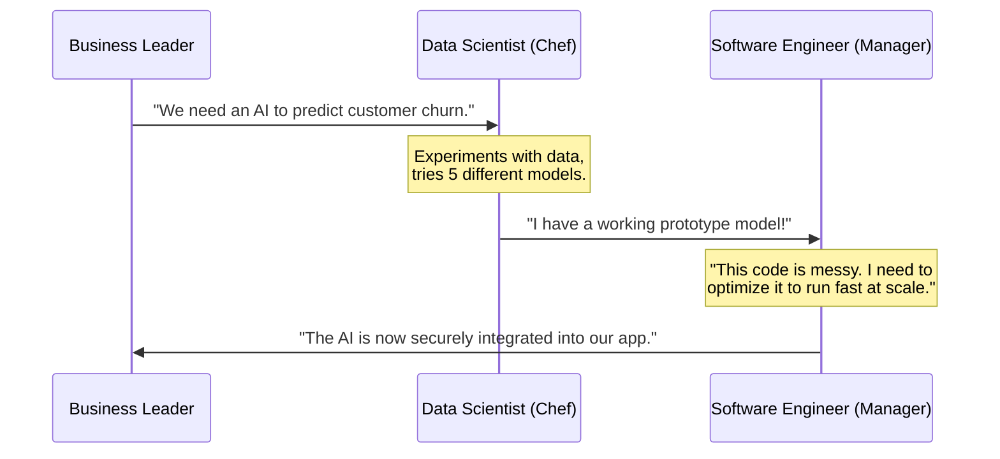

# The Layman's Guide to AI: Line 12 - AI Product Management & Strategy (The Boardroom)

Welcome to **Line 12** of the AI Metro Map! If the previous lines were about assembling the engine, this line is about deciding where the train is going, how much the tickets cost, and who is driving. Welcome to **The Boardroom**.

AI isn't just about cool algorithms and massive datasets; it's about solving real business problems. In this guide, we'll explore the strategic side of AI: deciding whether to build or buy, calculating ROI, managing different types of technical talent, and successfully integrating AI into a real business.

---

## 1. The "Build vs. Buy" Decision: Renting a Fleet vs. Building a Custom Car

Imagine you need vehicles for your company's delivery service. You have two choices:
1. **Buy/Rent (Off-the-shelf AI):** Go to a dealership and lease a fleet of standard delivery vans. It’s quick, reliable, and the manufacturer handles the heavy maintenance. 
2. **Build (Custom AI):** Hire engineers to design and build a car from scratch. It takes a long time and costs a fortune, but you get exactly the vehicle you need—maybe a specialized refrigerated truck that runs on solar power.

In AI, **"Buy"** means using existing services like OpenAI's API (ChatGPT), Google Cloud AI, or AWS. It’s fast and cost-effective for standard tasks like summarizing text, translating languages, or basic customer service. 

**"Build"** means training your own machine learning models from scratch. It's expensive and risky, but absolutely necessary if your problem is highly unique or if your competitive advantage relies on keeping your data private (like a proprietary Wall Street trading algorithm).

---

## 2. The ROI of AI: Is the Juice Worth the Squeeze?

Return on Investment (ROI) is the boardroom's favorite concept. Evaluating an AI project is a lot like deciding whether to draft a highly-paid superstar athlete for your sports team.

If you pay a superstar $50 million (the cost of developing and running the AI), they had better sell $70 million in extra tickets, merchandise, and sponsorships (the revenue). If they only bring in $10 million, you've made a terrible investment, no matter how flashy they look on the field.

When evaluating an AI feature, always ask:
* **Cost:** How much will it cost to build, run, and maintain? (Warning: AI servers and computing power can be incredibly expensive to run continuously).
* **Revenue/Savings:** Will it tangibly increase sales, reduce manual labor hours, or prevent costly errors?
* **Risk Tolerance:** What happens if the AI makes a mistake? If a music recommendation AI guesses wrong, the user just skips the song. If a medical diagnostic AI guesses wrong, it's a disaster.

---

## 3. Managing Talent: The Experimental Chef vs. The Kitchen Manager

Managing a tech team to build an AI product involves two very different types of professionals: **Data Scientists** and **Software Engineers**. Managing them requires understanding that their jobs are fundamentally different—like running a restaurant.

**Data Scientists (The Experimental Chefs):**
They are in the test kitchen trying to invent a brand new recipe. Their work is highly uncertain and research-based. They might spend a month mixing ingredients (data) only to find out the dish tastes terrible (the AI model doesn't work). They value exploration, testing, and flexibility.

**Software Engineers (The Kitchen Managers):**
They build the actual kitchen, the plumbing, the ovens, and the point-of-sale system. Their work is highly deterministic. If they build a checkout system, it works reliably every time. They value stability, speed, and clean, repeatable processes.

If you manage a Data Scientist exactly like a Software Engineer (demanding to know exactly which day their "research" will succeed), they will fail. You manage Data Scientists by defining the *problem* and giving them room to experiment. You manage Software Engineers by giving them clear *requirements* to build the final, stable product.

---

## 4. Integrating AI: Don't Bolt a Jet Engine to a Bicycle

Integrating AI into a real business isn't just about adding a shiny new feature button to your website. If you strap a jet engine to a bicycle, it won't fly—it will just fall apart.

To successfully use AI, the rest of the business ecosystem must adapt:
* **Data Infrastructure:** AI is only as good as the data it eats. If your company's data is a disorganized mess of outdated Excel files, your AI will produce garbage. 
* **User Experience (UX):** Users need to know how to interact with AI gracefully. Because AI can sometimes hallucinate or be uncertain, the interface should reflect that (e.g., "Here are three possible suggestions..." or allowing users to give a thumbs up/down).
* **Human-in-the-Loop:** AI isn't perfect. The most successful businesses use AI to *supercharge* humans, not replace them immediately. Let the AI do the heavy lifting of sorting data or drafting emails, but let a human make the final call before hitting "send."

**The Boardroom Takeaway:** AI is not magic pixie dust you can just sprinkle on a failing product to make it successful. It is a powerful engine that requires a solid chassis, a clear destination, and a skilled, diverse crew to operate.
