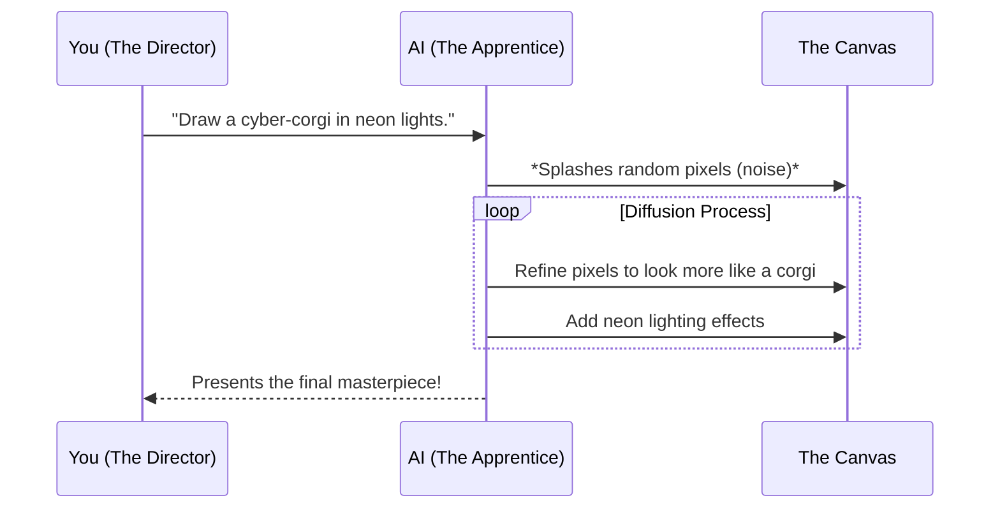
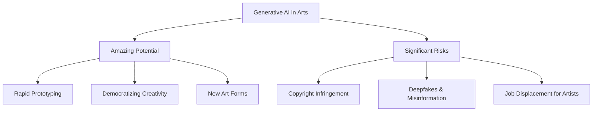

# Line 14 - AI in the Creative Arts (The Artist's Studio)

Welcome to Line 14 of the AI Metro Map: **The Artist's Studio**. Here, AI puts on a beret, grabs a paintbrush, a director's chair, and a synthesizer. We are exploring the thrilling—and sometimes controversial—world of Generative AI in the creative arts. 

Imagine having an eager apprentice in your studio. This apprentice has studied every master painting, listened to every song, and watched every movie ever made. When you say, "Paint me a futuristic city at sunset in the style of Van Gogh," or "Compose a catchy pop song about a time-traveling detective," the apprentice instantly gets to work, sketching and riffing until they produce something entirely new. 

That apprentice is Generative AI. 

Let's tour the different creative studios along this line.

## 🎨 Image Generation: The Digital Canvas (Midjourney & Friends)

Remember when creating digital art required years of learning complex software? Today, AI models like **Midjourney**, **DALL-E**, and **Stable Diffusion** act as magic paintbrushes. You type in a text prompt, and the AI generates stunning, high-resolution images in seconds.

### How it Works: The Apprentice's Sketchbook

When you ask the AI to draw an image, it relies on a process called "diffusion." Think of it as starting with a canvas full of random paint splatters (digital noise). The AI then meticulously "cleans up" those splatters, step by step, shaping them into recognizable forms that match your description, based on the millions of images it studied during its training.

## 🎬 Generative AI for Hollywood: The Director's Chair

Hollywood has always loved visual effects, but AI is completely changing how movies are made. Tools like **Sora** or **Runway** allow filmmakers to generate highly realistic video clips simply from text descriptions. 

- **Storyboarding and Pre-visualization:** Directors can generate quick scene mock-ups instead of sketching them by hand.
- **De-aging and Digital Doubles:** Actors can be made to look 30 years younger, or entirely digital extras can populate massive crowd scenes.
- **Lip Syncing:** AI can seamlessly match a foreign language dub to the actor's actual mouth movements, so it looks like they are speaking the localized language perfectly.

## 🎵 Music Production: The Infinite Synthesizer (Suno & Udio)

If you thought AI was just for visuals, put on your headphones. Platforms like **Suno** and **Udio** are revolutionizing music production. You don't need to know how to play the guitar or sing in perfect pitch. You can provide a genre, a mood, and some lyrics, and the AI will generate a fully produced song—complete with instruments and astonishingly human-like vocals.

**The Analogy:** It's like having a world-class studio band waiting for your instructions. You hand them the lyrics and say, "Give me an upbeat 80s synth-pop track," and they instantly play a radio-ready hit.

## ⚖️ The Dark Room: Copyright and Deepfakes

While this new creative frontier is incredibly exciting, it also brings up serious challenges. 

### The Copyright Conundrum

To teach the "apprentice" how to paint or compose, AI developers had to show them billions of existing works—many of which are copyrighted by human artists. 
- **The Debate:** Is it fair for an AI to learn from an artist's work without permission or compensation, and then generate competing art in their exact style? 

### The Deepfake Dilemma

When AI can perfectly mimic someone's face and voice, seeing is no longer believing.
- **Deepfakes** are hyper-realistic, AI-generated videos or audio recordings of real people doing or saying things they never actually did.
- **The Threat:** From unauthorized use of an actor's likeness (like the recent strikes in Hollywood) to political misinformation, deepfakes require us to be more critical of the media we consume.

## Conclusion

Line 14 represents the collision of technology and human imagination. While the AI is the powerful apprentice, it still requires the visionary "master artist"—you—to provide the spark of creativity. As we navigate this space, society will have to draw new lines around ownership, authenticity, and what it truly means to be an artist.
