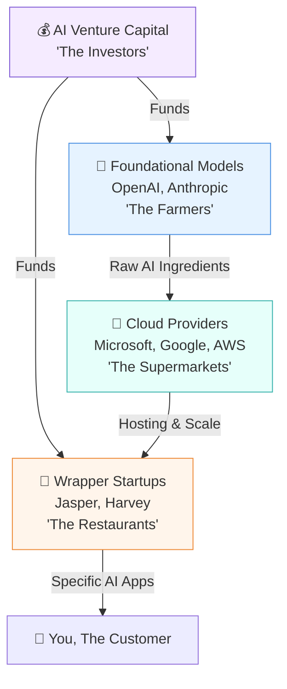

# 📈 Line 15: The Business of AI (The Stock Exchange) - A Layman's Guide

Imagine you are craving a delicious, gourmet pizza. You don't usually go buy a plot of land, grow your own wheat, mill the flour, plant tomatoes, and build a brick oven. Instead, you go to a restaurant. That restaurant likely bought its ingredients from a massive food distributor (a supermarket), who in turn bought literal tons of raw crops from a few massive farms.

This is exactly how the **Business of Artificial Intelligence** works today. It is a multi-billion-dollar ecosystem of "farmers," "supermarkets," and "restaurants," all trying to serve you the best AI experience. Welcome to Line 15 of the AI Metro Map: The Stock Exchange.

---

## 📖 Table of Contents

* [1. The AI Food Chain](#1-the-ai-food-chain)
* [2. Foundational Model Providers (The Farmers)](#2-foundational-model-providers-the-farmers)
* [3. Cloud Providers (The Supermarkets)](#3-cloud-providers-the-supermarkets)
* [4. Wrapper Startups (The Restaurants)](#4-wrapper-startups-the-restaurants)
* [5. AI Venture Capital (The Investors)](#5-ai-venture-capital-the-investors)
* [6. Open Source vs. Closed Source (Public vs. Private Farms)](#6-open-source-vs-closed-source-public-vs-private-farms)
* [7. Summary](#7-summary)

---

## 1. The AI Food Chain

To understand who makes money in AI, you have to look at how the technology is created and distributed. It flows down a chain from the people who build the core technology, to the people who host it, down to the people who sell it to you.

---

## 2. Foundational Model Providers (The Farmers)

These are companies like **OpenAI** (makers of ChatGPT) and **Anthropic** (makers of Claude). 

They build the core, massive "brains" called Foundational Models. This is like running a colossal industrial farm. Growing a state-of-the-art AI model takes thousands of specialized computers (GPUs) running for months, costing hundreds of millions of dollars. It is the raw, unflavored ingredient of the AI world. 

Just like you wouldn't eat a bowl of raw flour, a foundational model on its own isn't always perfectly tailored for a specific business task until it's "cooked."

---

## 3. Cloud Providers (The Supermarkets)

Farmers need a way to distribute their crops globally without them spoiling. In the tech world, these are the **Cloud Providers**: Microsoft Azure, Google Cloud, and Amazon Web Services (AWS).

These tech giants own the massive data centers (the refrigerated trucks and supermarket shelves) required to run these heavy AI models and serve them to millions of customers every second without the system crashing. 

> [!NOTE]
> **The Microsoft/OpenAI Alliance:** Sometimes, the supermarket buys the farm! Microsoft invested billions into OpenAI. In return, Microsoft Azure is the exclusive "supermarket" where businesses can buy OpenAI's ingredients. Google, on the other hand, grows its own crops (Gemini) *and* owns the supermarket (Google Cloud).

---

## 4. Wrapper Startups (The Restaurants)

Most AI startups you see today are what the industry calls **"Wrapper Startups."** 

These companies don't spend millions building their own AI from scratch. Instead, they buy the "raw ingredients" from OpenAI or Anthropic via an API, "wrap" it in a beautiful user interface (the plating), give it specific customized instructions (the recipe), and sell it to a niche market.

*   An AI that writes marketing emails.
*   An AI that reviews legal contracts.
*   An AI that acts as a math tutor.

They are the restaurants. They take the raw AI, cook it into a specific dish, and serve it to you. 

> [!WARNING]
> **The Wrapper Risk:** Running a restaurant is risky! If a wrapper startup's only feature is summarizing PDFs, and OpenAI decides to add "PDF summarizing" as a free feature to ChatGPT, the startup's entire business model goes up in smoke overnight.

---

## 5. AI Venture Capital (The Investors)

None of this ecosystem works without capital. **AI Venture Capitalists (VCs)** are the wealthy investment firms that write the massive checks.

Building an AI model is breathtakingly expensive because you have to buy the "tractors"—in this case, Nvidia microchips. VCs give the farmers the billions they need to build their models. They also fund the thousands of Wrapper Startups, hoping that one of them becomes the next "McDonald's of AI" and brings in massive returns.

---

## 6. Open Source vs. Closed Source (Public vs. Private Farms)

There is a massive philosophical (and financial) war happening in the AI business regarding who gets to see the recipe.

### 🔒 Closed Source (The Private Farm)
Models like OpenAI's GPT-4 and Anthropic's Claude are **closed source**. You can buy their tomatoes, but they will *never* give you the seeds. They keep their models locked down as closely guarded corporate secrets. You can pay to use them, but you can't see how they work under the hood.

### 🔓 Open Source (The Community Garden)
Companies like Meta (makers of the **Llama** models) and Mistral are releasing **open source** models. They are giving away the "seeds" for free. Anyone can download the core model, plant it on their own computer, change the code, and build upon it without paying a toll to a gatekeeper.

> [!TIP]
> **Why would Meta give it away for free?**
> By making the raw ingredients free, Meta commoditizes the AI market. This hurts their competitors (like OpenAI) who are trying to sell those ingredients, while creating a massive global community of developers who end up improving Meta's AI ecosystem for them.

---

## 7. Summary

The business of Artificial Intelligence is much more than just a single chatbot. It is a layered economy. 

Value is created at the very bottom by the **Investors** buying the hardware and the **Farmers** (Foundational Models) growing the intelligence. It is scaled globally by the **Supermarkets** (Cloud Providers). Finally, it is customized, packaged, and sold to everyday people by the **Restaurants** (Wrapper Startups). 

Understanding this food chain is the key to understanding who holds the power—and the money—in the modern AI boom.
