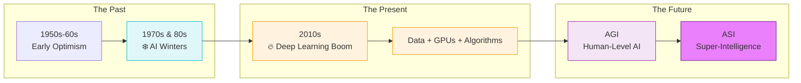
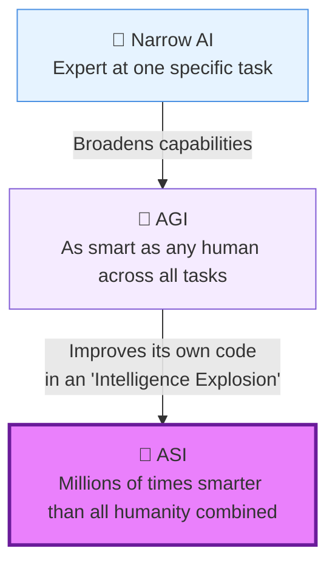

# 🚀 The Time Machine: A Layman's Guide to AI's Past and Future (Line 16)

Imagine you are on a centuries-long expedition to a new, distant galaxy. The journey hasn’t been a smooth, continuous flight. There were times when the engines stalled, and the crew had to hibernate through harsh, freezing periods. But recently, you’ve discovered a revolutionary new rocket fuel, and now you’re hurtling toward a destination that could change everything—a place where the ship might just learn to fly itself better than you ever could. 

This is the story of Artificial Intelligence. **Line 16** of our AI Metro Map takes us on a journey through time: looking back at the "Ice Ages" of AI's past, exploring the explosive acceleration of the present, and gazing into a future that sounds like science fiction, but might just become reality.

---

## 📖 Table of Contents

* [1. The Cold Years: The AI Winters](#1-the-cold-years-the-ai-winters)
* [2. The Big Thaw: The Deep Learning Boom](#2-the-big-thaw-the-deep-learning-boom)
* [3. The Next Stop: AGI (Artificial General Intelligence)](#3-the-next-stop-agi-artificial-general-intelligence)
* [4. Beyond the Stars: ASI (Artificial Super Intelligence)](#4-beyond-the-stars-asi-artificial-super-intelligence)
* [5. Summary: Navigating the Future](#5-summary-navigating-the-future)

---

## 1. The Cold Years: The AI Winters

In the early days of space exploration (the 1950s and 60s for AI), people were incredibly optimistic. Scientists thought they could build a human-like brain in just a few years. But it turns out, building a brain is much harder than teaching a computer to play checkers.

When the technology couldn't live up to the massive hype, funding dried up, research stalled, and enthusiasm froze solid. These periods became known as the **AI Winters** (primarily occurring in the 1970s and late 1980s). 

> [!NOTE]
> Think of an AI Winter like a harsh "Ice Age" in an evolutionary timeline. Progress didn't stop entirely, but only the most robust and stubborn ideas survived under the ice, waiting for the right conditions to thaw out.

---

## 2. The Big Thaw: The Deep Learning Boom

So, what melted the ice? The answer is the **Deep Learning Boom** of the 2010s. 

To continue our space analogy, imagine the scientists were stuck because they were trying to build a rocket using only a wrench and a bicycle pump. To break through, they needed three new things:
1. **Massive amounts of Data** (The Fuel) - The internet exploded, providing billions of images, texts, and videos.
2. **Powerful Computers** (The Engine) - Specifically, GPUs (Graphics Processing Units), which were originally made for video games but turned out to be perfect for training AI.
3. **Better Algorithms** (The Blueprint) - The refinement of "neural networks," which loosely mimic the human brain.

When you mix that fuel into that engine using those blueprints, you get a rocket taking off at lightspeed. This is why today we have AI that can paint pictures, write code, and converse like a human.

---

## 3. The Next Stop: AGI (Artificial General Intelligence)

Today's AI is incredible, but it's what we call **Narrow AI**. It's like a highly specialized crew member on our spaceship who is the absolute best in the universe at plotting navigation coordinates, but if you ask them to cook a meal or fix a pipe, they have absolutely no idea what to do.

**AGI (Artificial General Intelligence)** is the holy grail. It is an AI that is as smart as a typical human across *any* task. 

If Narrow AI is a specialized tool like a calculator, AGI is like hiring a brilliant, versatile human employee who never sleeps. You could teach an AGI to write a novel in the morning, invent a new recipe in the afternoon, and help design a better spaceship by night.

> [!TIP]
> **The AGI Test:** You know we have achieved AGI when an AI can sit down at a computer, look at a brand new job it has never seen before, learn how to do it from scratch, and do it just as well as you can.

---

## 4. Beyond the Stars: ASI (Artificial Super Intelligence)

If AGI is an AI that matches human intelligence, **ASI (Artificial Super Intelligence)** is what happens next. And it might happen very fast.

Imagine our spaceship’s computer finally reaches AGI. It is now as smart as the smartest human engineers. What is the very first thing we ask it to do? *“Hey, can you design an even smarter version of yourself?”*

Since the AGI can think and work millions of times faster than a human, it designs a slightly smarter version. That smarter version designs an even smarter one. This is called an **Intelligence Explosion**. 

**What does ASI look like?** 
We don't really know. Trying to explain ASI to a human is like a human trying to explain calculus to an ant. An ASI might cure all known diseases in a weekend, solve the energy crisis, or figure out how to travel faster than light. It represents a horizon beyond which human comprehension stops—the ultimate destination of our journey.

---

## 5. Summary: Navigating the Future

* **The AI Winters** taught us humility. Progress in AI isn't always a straight line; it requires the right environment and resources to thrive.
* **The Deep Learning Boom** is the rocket ship we are currently riding, fueled by massive data and powerful computers.
* **AGI** is the next milestone: an AI that can learn and do anything a human can do.
* **ASI** is the great unknown: a super-intelligence that eclipses human capability, potentially changing the fabric of our reality forever.

Just like navigating a spaceship to a new galaxy, the timeline of AI requires patience, vision, and a little bit of awe for what waits on the horizon.
