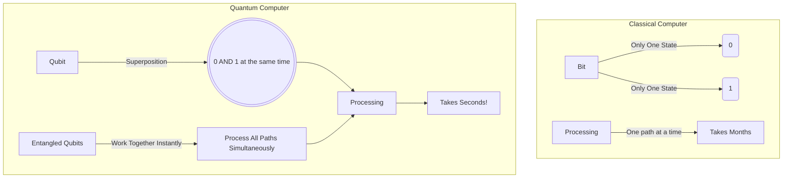

# Layman's Guide to Line 17: Quantum AI (The Science Fiction Lab)

Welcome to **Line 17**, the absolute frontier of the AI Metro Map! If classical AI is a high-speed bullet train, Quantum AI is a teleportation device. This is where the mind-bending rules of quantum physics meet the number-crunching power of Artificial Intelligence. 

It might sound like pure science fiction, but scientists are actively building this in labs today. Let's demystify how it works without needing a degree in advanced physics!

---

## 1. The Basics: Bits vs. Qubits (The Coin Flip Analogy)

To understand Quantum AI, we first have to understand the engines that will power it: **Quantum Computers**.

In a normal (classical) computer—like the phone or laptop you're using right now—information is stored in **Bits**. A bit is like a light switch: it can only be **ON (1)** or **OFF (0)**. 
* **Analogy:** Imagine a coin lying flat on a table. It is either **Heads** or **Tails**.

A quantum computer uses **Qubits** (Quantum Bits). 
* **Analogy:** Imagine flipping that coin into the air. While it is spinning in mid-air, is it Heads or Tails? It's a blur of *both* at the same time. 

This magical spinning state is called **Superposition**. Because a qubit can be both a 0 and a 1 simultaneously, it can process an exponentially larger amount of information than a regular bit.

---

## 2. Spooky Connections: Entanglement

If superposition is the first superpower of quantum computing, the second is **Entanglement**. Albert Einstein famously called this "spooky action at a distance."

Imagine you have two magic quantum coins. You flip them both into the air so they are both spinning (in superposition). If these coins are *entangled*, they are intimately linked. The moment you catch one coin and it lands on **Heads**, the other coin will *instantly* and magically land on **Tails**—even if it's on the other side of the universe!

When qubits are entangled in a computer, they work together perfectly. Changing the state of one qubit instantly changes the state of another, allowing the computer to solve incredibly complex puzzles at lightning speed.

### Visualizing the Difference

---

## 3. How Quantum Speeds Up AI (The Maze Analogy)

Training a powerful AI today—like the ones that write essays, generate art, or fold proteins—takes massive data centers running for months. 

Think of AI training as trying to find the center of a giant maze:
* **Classical AI** has to run down one path. If it hits a dead end, it walks back and tries the next path. It checks them one by one. Fast, but it still takes time.
* **Quantum AI**, thanks to superposition and entanglement, is like flooding the entire maze with water. It explores *all possible paths simultaneously*. 

By considering millions of possibilities at the exact same moment, Quantum AI could theoretically condense an AI training process that normally takes **months** down to mere **seconds**.

---

## 4. Why is it still the "Science Fiction Lab"?

You might be wondering, *"If this is so fast, why aren't we using it today?"*

Right now, qubits are incredibly fragile. Just like a spinning coin will easily fall over if a gust of wind hits it, qubits lose their "spin" (superposition) if there is even a tiny change in temperature or vibration. They have to be kept in special refrigerators colder than deep space!

We are still in the experimental phase—learning how to keep qubits stable and correcting errors. But when we finally stabilize this technology, Quantum AI will unlock cures for diseases, design revolutionary new materials, and solve problems that classical computers couldn't crack in a million years. 

Welcome to the future. Mind the gap!
