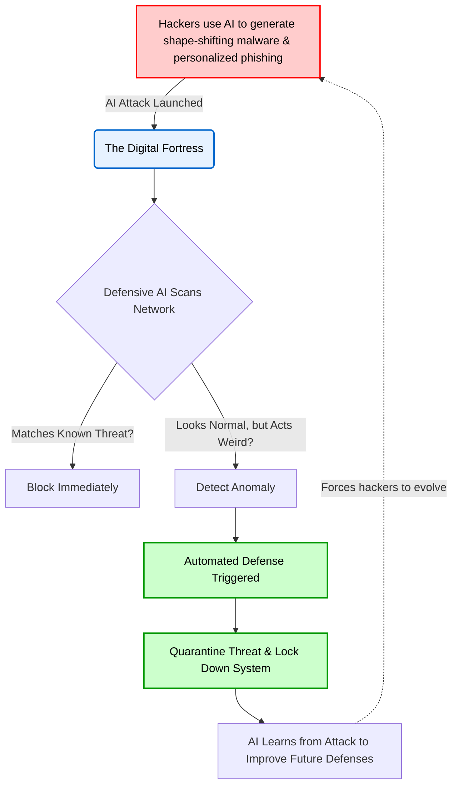

# Layman's Guide to Line 18: AI in Cyber Warfare & Security (The Digital Fortress)

Welcome to **Line 18**, where the virtual world's greatest battles are fought silently and at lightning speed. This is the realm of AI in Cyber Warfare and Security—a high-stakes digital fortress where Artificial Intelligence is both the ultimate weapon and the ultimate shield.

Imagine a grand castle. In the past, defending this castle meant building high walls and waiting for enemies to attack with battering rams. Today, the enemies are invisible, moving at the speed of light, and they can change their shape at will. To defend against them, you need guards who can think just as fast and predict the enemies' next moves. That's what AI does in cybersecurity.

---

## ⚔️ The AI Arms Race: Spies vs. Guards

We are currently in the middle of a massive AI arms race. It's a continuous game of cat and mouse between cybercriminals (the attackers) and cybersecurity teams (the defenders). Both sides are using the exact same powerful AI technologies, but for entirely different purposes.

### The Attackers (Shape-Shifting Spies)

Hackers use AI to scale up their operations and make their attacks smarter, faster, and much harder to detect. 

*   **Automated Phishing:** You probably know what phishing is—those scam emails trying to trick you into giving away your password. In the past, these were easy to spot because of bad grammar and generic greetings. Today, AI can read your public social media posts and automatically craft a perfectly personalized, flawless email pretending to be your boss or your bank. It's like a spy disguising themselves flawlessly as your best friend.
*   **Malware Generation (Polymorphic Code):** Traditional computer viruses had a specific "signature," like a fingerprint. Security software would look for that fingerprint to block the virus. But hackers now use AI to create *shape-shifting malware*. Every time the virus moves to a new computer, the AI rewrites its code so it looks completely different, all while doing the same damage. It's a master of disguise slipping past the castle guards.

### The Defenders (The Ever-Watchful Guards)

To fight back against AI-powered attacks, cybersecurity teams need AI-powered defenses. Human security analysts simply cannot read through millions of logs and alerts fast enough.

*   **Anomaly Detection:** Instead of just looking for known virus fingerprints, defensive AI learns what "normal" looks like for your network. It knows that you usually log in from New York at 9 AM. If suddenly someone tries to log in using your password from halfway across the world at 3 AM, the AI instantly flags it as an anomaly. It's like a castle guard who notices that a "merchant" doesn't walk or talk quite right and stops them at the gate.
*   **Automated Threat Neutralization:** When a threat is detected, the AI doesn't wait for a human to wake up and click a button. It can instantly lock down affected computers, block the attacker's IP address, and quarantine the suspicious files. It’s an automated response team that builds a new wall the moment a breach is detected.

---

## 🏰 The Siege: How AI Attack and Defense Works

Here is a simple look at how this constant battle unfolds at the gates of our digital fortress:

## 🛡️ Summary

In the world of Cyber Warfare, AI is a dual-edged sword. Hackers use it to create relentless, intelligent, and highly personalized attacks that traditional security systems can't stop. However, cybersecurity experts use AI to build dynamic, ever-learning defenses that can spot the subtlest anomalies and neutralize threats in milliseconds. 

As the attackers get smarter, the defenders get smarter too. It is a never-ending battle to secure the digital fortress.
