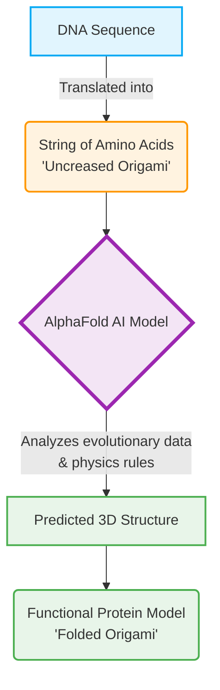
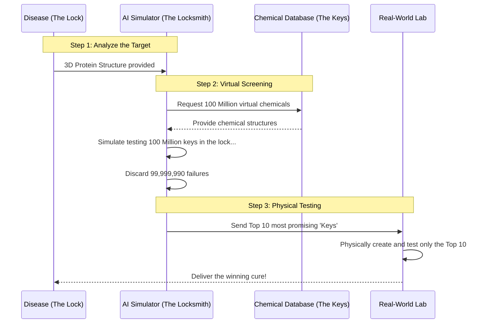

# 🚇 Line 19: AI Drug Discovery & Biology (The Laboratory)

Welcome to **Line 19**, the sector of the AI Metro Map where computers step out of the digital realm and into the very building blocks of life. Here, AI isn't just generating text or images; it's discovering new medicines, understanding human biology, and potentially saving lives. 

Let's explore the two major stops on this line: **Protein Folding** and **Accelerated Drug Discovery**.

---

## 🧬 Stop 1: The Protein Folding Problem (and How AI Solved It)

To understand this stop, you first need to understand **proteins**. Proteins are the microscopic machines that do almost everything in your body—from digesting food to fighting off viruses. 

Imagine a protein as a long, straight chain of chemical beads (amino acids). But a straight chain can't do any work. To become a functional machine, that chain has to fold itself into a highly specific, tangled 3D shape. 

**The Analogy: The Impossible Origami**
Imagine you are given a 100-foot-long piece of paper with instructions written on it. To read the secret message, you must fold the paper using thousands of complex origami folds. One wrong crease, and the message is destroyed. 

For 50 years, scientists struggled to figure out how these straight chains fold into their 3D shapes. It was a painstaking process that took months or years for a *single* protein. 

Then came AI systems like **AlphaFold**. AlphaFold is like an origami master who can glance at the uncreased 100-foot paper and instantly visualize the final 3D swan. Using advanced deep learning, AI was able to predict the 3D structures of hundreds of millions of proteins in a fraction of the time, essentially "solving" one of biology's greatest mysteries.

### The AlphaFold Process

---

## 💊 Stop 2: Accelerating Drug Discovery 

Now that we know the 3D shapes of these microscopic biological machines, how do we fix them when they break down and cause disease? This is where the magic of AI drug discovery happens.

**The Analogy: A Billion Keys for a Billion Locks**
Imagine a disease (like cancer or a virus) as a highly complex, microscopic **lock**. To cure the disease, you need to find the perfect **key** (a chemical compound or medicine) that will slide into that lock and jam it, stopping the disease in its tracks.

In the past, finding that key was a guessing game. Scientists would physically create chemical "keys" in a real-world laboratory and test them one by one. Finding a drug this way takes over a decade and costs billions of dollars, with a high chance of failure.

Today, AI acts as a digital master locksmith. Because AI now knows what the 3D "locks" look like (thanks to AlphaFold), it can use powerful supercomputers to simulate millions of virtual chemical "keys" fitting into the lock. It can test millions of combinations in days, rather than decades. 

It can even design **personalized medicines**—creating a bespoke key designed specifically for the unique lock found in a single patient's body.

### How AI Discovers Drugs

---

## 🏁 Summary

Line 19 is where AI transcends the digital screen and impacts human health. By solving the protein folding problem, AI gave us a map of biology's building blocks. Now, by simulating how millions of chemicals interact with those blocks, AI is shaving years off the drug discovery process, ushering in an era of faster, cheaper, and personalized medicine.
