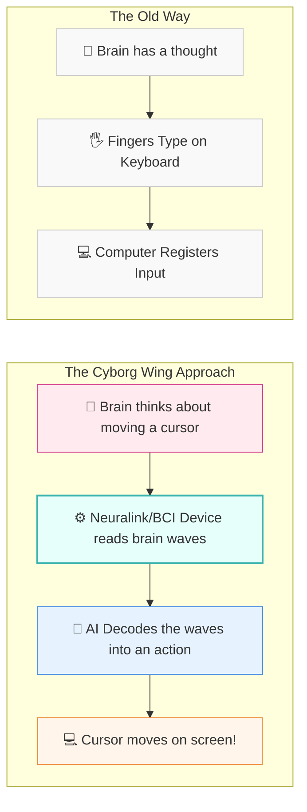

# 🧠 Line 20: Brain-Computer Interfaces & Neuromorphic Chips (The Cyborg Wing)

Welcome to the Cyborg Wing! If the rest of the AI Metro Map is about teaching computers to act like humans, Line 20 is about bringing computers and humans together—literally. Here, we're going to explore two mind-bending concepts:
1. **Neuromorphic Chips:** Rebuilding computers from the ground up using biological blueprints.
2. **Brain-Computer Interfaces (BCIs):** Plugging a keyboard directly into your thoughts.

---

## 📖 Table of Contents

* [1. Neuromorphic Chips: Building Computers out of Biological Blueprints](#1-neuromorphic-chips-building-computers-out-of-biological-blueprints)
* [2. Brain-Computer Interfaces (BCIs): Plugging a Keyboard Directly into Your Thoughts](#2-brain-computer-interfaces-bcis-plugging-a-keyboard-directly-into-your-thoughts)
* [3. The Future: When AI Meets the Brain](#3-the-future-when-ai-meets-the-brain)
* [4. Summary](#4-summary)

---

## 1. Neuromorphic Chips: Building Computers out of Biological Blueprints

Think about your smartphone or laptop. They are powerful, but they run incredibly hot and drain battery like crazy. They are like massive, gas-guzzling trucks. 

Your brain, on the other hand, runs on about 20 watts of power—less than a dim lightbulb! Yet, it can recognize a face, solve a complex math problem, and enjoy a song all at the exact same time. How?

Traditional computer chips work on a simple clock system. They process data step-by-step, non-stop, in a very orderly but energy-heavy way. Your brain uses a totally different system: **Spiking Neural Networks**. 

### What is a Spiking Neural Network?

Imagine a crowded room. In a traditional computer, everyone is yelling at the same time, constantly repeating their information. In your brain, everyone is quiet until they have something important to say, at which point they raise their hand or "spike." 

**Neuromorphic chips** are designed to physically mimic this brain-like behavior. They use tiny artificial neurons and synapses built right into the hardware. Instead of being "always on," these chips only consume energy when a signal (a spike) actually needs to be sent.

> [!TIP]
> Think of a traditional chip as a traffic light that changes from red to green on a timer, even if no cars are there. A neuromorphic chip is a smart sensor light—it only turns green when a car actually pulls up. 

By building computers out of these biological blueprints, we can create AI that runs on incredibly low power, allowing smart devices to last for months on a single charge while processing complex information instantly.

---

## 2. Brain-Computer Interfaces (BCIs): Plugging a Keyboard Directly into Your Thoughts

If Neuromorphic Chips are about making computers act like brains, **Brain-Computer Interfaces (BCIs)**—like the ones developed by Neuralink—are about making brains talk to computers.

Right now, getting an idea out of your head and into a machine is incredibly slow. You have to type it with your fingers or speak it out loud. It's like having a gigabit fiber-optic internet connection in your brain but forcing all that data to squeeze through a tiny, old-school dial-up modem (your thumbs).

### How does a BCI work?

A BCI bypasses the physical bottleneck entirely. It "listens" to the electrical activity (brain waves) your brain naturally produces when you think or intend to move. 

### The Role of AI in Reading Minds

Your brain doesn't speak binary code (0s and 1s), and it certainly doesn't output plain English. It speaks in a messy, chaotic storm of electrical spikes. 

This is where AI swoops in to save the day. The AI acts as the ultimate **translator**. It takes the raw, noisy brain wave data and learns the patterns. It realizes, *"Ah, when the electrical spikes look exactly like this pattern, it means the user wants to click the mouse."*

> [!NOTE]
> It is quite literally like plugging a keyboard directly into your thoughts! You don't have to move a single muscle. You just *think* about clicking a button, the BCI picks up the electrical spark, the AI translates it, and the computer clicks the button for you.

---

## 3. The Future: When AI Meets the Brain

When you combine Neuromorphic Chips and BCIs, you unlock the true potential of the "Cyborg Wing." 

Imagine a BCI implant that doesn't just read your thoughts, but processes them using a low-power, brain-like neuromorphic chip right there on the device. 
* It could help paralyzed individuals control robotic limbs as naturally as their own arms.
* It could restore vision by sending camera signals directly into the visual cortex of the brain.
* It could even allow us to seamlessly access information from the internet just by thinking about it.

---

## 4. Summary

The Cyborg Wing represents the ultimate convergence of biology and technology:
1. **Neuromorphic Chips** take the brain's physical architecture—its low-power, spiking behavior—and use it to build better, more efficient computers.
2. **Brain-Computer Interfaces (BCIs)** take the brain's electrical signals and use AI to translate them, allowing us to control machines with just our thoughts.

It might sound like science fiction, but the foundations are being laid today. The bridge between the human mind and artificial intelligence is finally being built!
