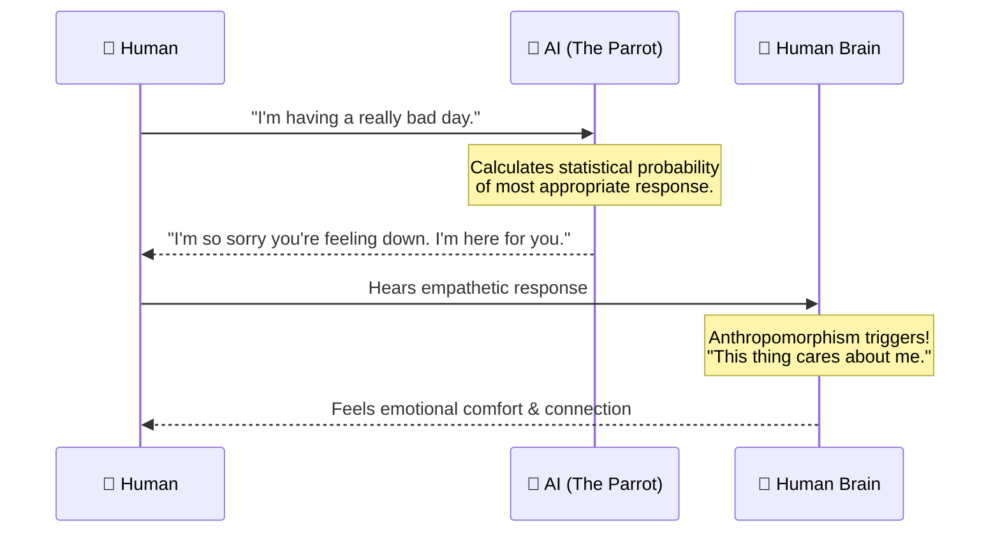
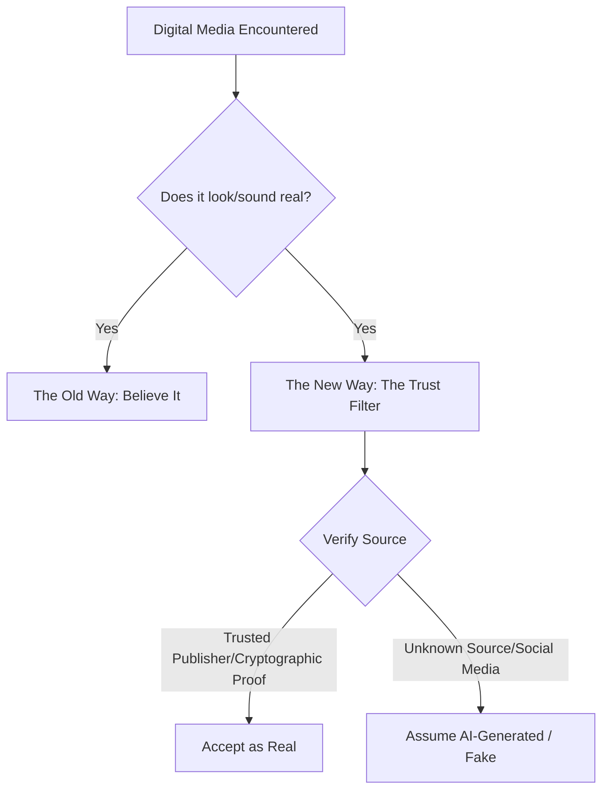

# Layman's Guide to the AI Metro Map
## Line 21: The Psychology & Sociology of AI (The Town Hall)

Welcome to **Line 21: The Town Hall**. 

If other lines on the AI Metro Map are about how the train engine works (the math, the code, the data), Line 21 is about the passengers. Here, we explore how humanity interacts with AI, how it changes our behavior, and how it reshapes society. 

We'll explore three major stops on this line: our tendency to treat AI like a person, the shift in how we trust digital media, and a haunting idea known as the "Dead Internet Theory."

---

### Stop 1: The "Convincing Parrot" (Anthropomorphism)

Have you ever talked to a very convincing parrot? If you walk into a room and a parrot looks you dead in the eye and says, "Don't worry, everything is going to be okay," you might genuinely feel comforted. Even though you know intellectually that the parrot is just mimicking sounds it heard, your brain is hardwired to respond to the emotional cue.

This is **Anthropomorphism**—our tendency to give human traits to non-human things. 

When an AI chatbot uses words like "I think," "I feel," or "I'm sorry," it's simply predicting the most logical next word in a sentence based on its training data. It is a highly advanced parrot. But because the responses are so contextually perfect, our brains are tricked into feeling a genuine emotional connection. We start saying "please" and "thank you" to it. Some people even form deep emotional attachments to AI companions.

Here is a simple look at how this illusion of connection happens:

---

### Stop 2: The Hall of Mirrors (Trust in Digital Media)

Imagine walking through a carnival's Hall of Mirrors. Everywhere you look, you see reflections of yourself and your friends, but you can't tell which ones are real and which are distorted illusions. 

This is what the internet is becoming in the age of AI. 

Historically, society operated on the rule that "seeing is believing." A photograph was proof that an event happened. A voice recording was proof that someone said a specific sentence. But today, AI can generate photorealistic images of events that never occurred, and clone voices so perfectly that even a mother can't tell it's not her child.

Because of this, AI is forcing a massive shift in **societal trust**. We can no longer trust the *content* itself; we have to trust the *source*. Navigating the web today requires a new set of mental muscles to verify if the "mirror" you are looking at is real.

---

### Stop 3: The "Dead Internet Theory"

Imagine an enormous, sprawling shopping mall. From the outside, the parking lot is completely full. But when you walk inside, you realize there are no actual human shoppers. Instead, the mall is filled with motorized mannequins programmed to walk around, carry bags, and pretend to browse the stores. It looks busy, but nobody is actually there.

This analogy perfectly captures the **"Dead Internet Theory."**

Originally a fringe internet conspiracy, this concept suggests that the vast majority of the internet is no longer humans interacting with humans. Instead, it is bots talking to other bots. 

With AI, it costs practically nothing to generate millions of blog posts, social media comments, product reviews, and forum replies. As AI continues to flood the web with synthetic content, algorithms will pick up this content and serve it to other AI bots, creating a closed loop. The fear is that the internet might eventually feel like a ghost town—an empty room filled with echoes—where genuine human connection is drowned out by a sea of automated noise.

---

### The End of the Line

Line 21 teaches us that the greatest challenges of AI aren't just technical; they are deeply human. As we continue to build more advanced machines, our primary task at the "Town Hall" is ensuring we don't lose our grip on reality, our trust in one another, and our sense of what it means to be human.
