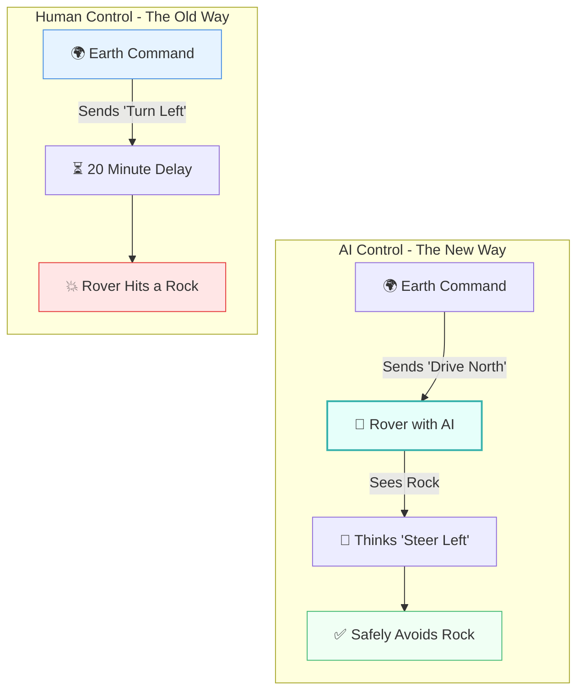
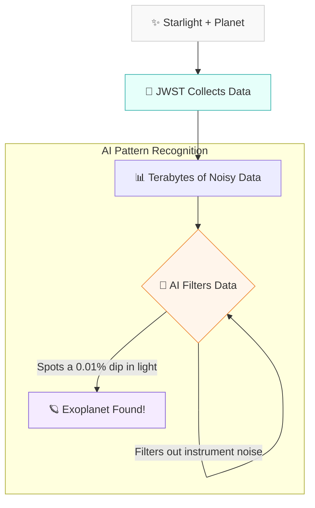

# 🔭 The Observatory: A Layman's Guide to AI in Space Exploration (Line 22)

Imagine you are trying to drive an RC car in your backyard, but the video feed on your controller is delayed by 20 minutes. Every time you push the joystick forward, you have to wait nearly half an hour just to see if your car hit a rock. By the time you realize you need to hit the brakes, the car is already upside down in a puddle.

This is exactly the problem scientists face when exploring deep space. The distances are so vast that communication takes incredibly long. You can't just "joystick" a rover on Mars from Earth. 

This is where "The Observatory" (Line 22 of the AI Metro Map) comes in. By equipping spacecraft, telescopes, and satellites with Artificial Intelligence, we are giving our space explorers the brains to think, drive, and analyze for themselves while we wait for their postcard to arrive in the mail.

---

## 📖 Table of Contents

* [1. The Delay Problem: Why Space Needs AI](#1-the-delay-problem-why-space-needs-ai)
* [2. Mars Rovers: The Ultimate Self-Driving Cars](#2-mars-rovers-the-ultimate-self-driving-cars)
* [3. James Webb Space Telescope: Finding Exoplanets in the Noise](#3-james-webb-space-telescope-finding-exoplanets-in-the-noise)
* [4. Earth-Observation: Our Planet's Health Tracker](#4-earth-observation-our-planets-health-tracker)
* [5. Summary](#5-summary)

---

## 1. The Delay Problem: Why Space Needs AI

When things go wrong in space, they go wrong fast. Spacecraft need to be able to make split-second decisions without waiting for humans on Earth to hold a committee meeting. AI allows these machines to become completely autonomous, acting as their own pilots and scientists.

---

## 2. Mars Rovers: The Ultimate Self-Driving Cars

Think about how hard it is to build a self-driving car on Earth. Now, try building one where there are no roads, no stop signs, no GPS, and the terrain is covered in unpredictable sand traps and jagged boulders.

Mars rovers (like Perseverance) use onboard AI for **autonomous navigation**. 
* **What happens:** As the rover moves, it constantly takes pictures of the terrain ahead.
* **The AI's job:** It analyzes these images instantly to build a 3D map of its surroundings, identifying safe paths and dangerous obstacles. It decides on its own how to steer around a ditch.

> [!TIP]
> Think of it like walking through a messy room in the dark. Instead of stubbing your toe and waiting for your brain to react, you have an AI flashlight that perfectly highlights the Lego bricks on the floor so you can step around them without breaking stride.

---

## 3. James Webb Space Telescope: Finding Exoplanets in the Noise

The James Webb Space Telescope (JWST) is the most powerful telescope ever built, but finding an "exoplanet" (a planet orbiting a distant star) is incredibly difficult. 

Imagine trying to spot a tiny firefly buzzing around a massive lighthouse from 10 miles away. The light from the star completely blinds our view of the tiny planet. Instead of looking directly at the planet, astronomers look for a tiny dip in the lighthouse's brightness when the firefly flies in front of it.

* **The AI's job:** JWST beams back mountains of messy, noisy data. AI is used to sift through this static, filtering out the blinding starlight and instrument noise to find the microscopic, regular dips in light that prove a planet is there. It can even help analyze the atmosphere of that planet to see if it holds water or oxygen!

---

## 4. Earth-Observation: Our Planet's Health Tracker

Space AI isn't just about looking out into the void; it's also about looking back home. We have hundreds of satellites orbiting Earth, taking pictures and collecting data on weather, forests, and oceans.

This generates so much data that human scientists could never look at every single picture.

* **What happens:** AI acts like a highly trained radiologist looking at an MRI, but instead of one patient, it's diagnosing the entire planet simultaneously.
* **The AI's job:** It scans millions of satellite images to track the health of our climate. It can automatically detect illegal deforestation in the Amazon, measure the melting rate of polar ice caps, and even predict where a wildfire will spread based on wind and dry brush.

> [!NOTE]
> It is like having a fitness tracker for the Earth. The AI monitors the planet's vital signs 24/7, alerting scientists the moment a fever (like a sudden ocean temperature spike) starts to form.

---

## 5. Summary

The universe is too big and too far away for humans to micromanage every second of exploration. By putting AI into the driver’s seat of our space technology—from steering rovers through Martian dust to sifting through starlight for alien worlds—we are extending our reach into the cosmos. 

In "The Observatory," AI isn't just a helpful tool; it's the co-pilot that makes modern deep-space exploration possible.
