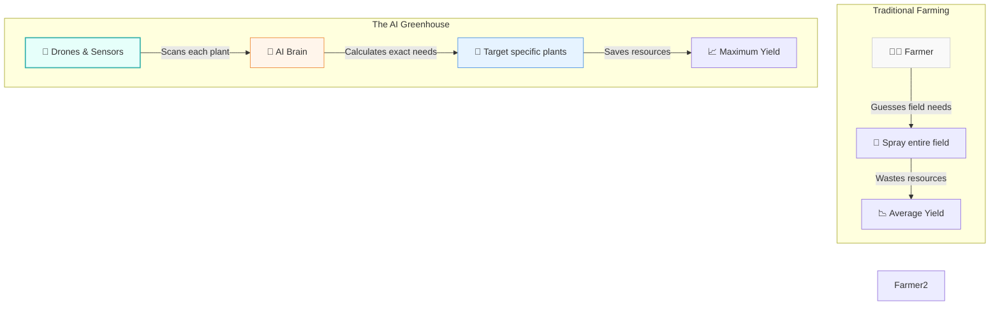

# 🌾 The Greenhouse: A Layman's Guide to AI in Agriculture & Food Security (Line 23)

Imagine you are a doctor, but instead of having twenty or thirty patients a day, you have a million. They are all standing in a massive field, and you have to check every single one of them to see if they are thirsty, sick, or need vitamins. Oh, and you have to do this every day. (Spoiler alert: you can't, and some patients will get sick while you are busy checking others).

Historically, this is how farming has worked. A farmer looks at a whole field and treats it as one giant entity—watering the whole thing, spraying pesticide on the whole thing, or harvesting the whole thing. 

But what if you didn't have to treat the whole field the same way? What if you had a million tiny doctors that could check every individual plant? Welcome to **Line 23 - The Greenhouse**. Here, Artificial Intelligence is revolutionizing agriculture by bringing precision, automation, and global coordination to our food supply.

---

## 📖 Table of Contents

* [1. What is The Greenhouse?](#1-what-is-the-greenhouse)
* [2. Precision Farming: Treating Plants as Patients](#2-precision-farming-treating-plants-as-patients)
* [3. Computer Vision: The Plant Doctor](#3-computer-vision-the-plant-doctor)
* [4. Autonomous Tractors: Tireless Field Workers](#4-autonomous-tractors-tireless-field-workers)
* [5. The Global Supply Chain: From Farm to Fork](#5-the-global-supply-chain-from-farm-to-fork)
* [6. Summary](#6-summary)

---

## 1. What is The Greenhouse?

In the AI Metro Map, **Line 23 (The Greenhouse)** represents the intersection of artificial intelligence and agriculture. It's not about replacing farmers; it's about giving them superpowers. By using AI, we can grow more food, use less water, reduce harmful chemicals, and ensure that what we grow actually makes it to people's plates before spoiling.

---

## 2. Precision Farming: Treating Plants as Patients

**Precision farming** is the core idea of The Greenhouse. Instead of treating a 100-acre field as a single organism, AI allows us to treat each plant individually. 

If one corner of the field is dry, the irrigation system only waters that corner. If a patch of corn lacks nitrogen, fertilizer is only applied there. 

> [!TIP]
> Think of it like a smart shower that only turns on the exact nozzles needed to clean the dirt on your body, rather than blasting the whole bathroom with water. It saves money, protects the environment, and grows healthier crops.

---

## 3. Computer Vision: The Plant Doctor

How does the AI know which plant is sick? It uses **Computer Vision**—essentially giving computers the ability to "see" and understand images.

Drones fly over fields, or cameras are mounted on tractors, snapping thousands of pictures of individual leaves per minute. The AI analyzes these images instantly. It can spot the tiny, rust-colored spots of a fungus or the bite marks of a specific pest long before a human eye could. 

* **The Old Way:** A farmer notices a disease when half the field is already dying, and they spray the whole farm with chemicals just in case.
* **The AI Way:** The camera spots a sick leaf on *Plant #4,592*, and a robotic arm gives just that one plant a micro-dose of medicine. 

---

## 4. Autonomous Tractors: Tireless Field Workers

We've all heard of self-driving cars, but self-driving tractors are already here, and they are changing the game. 

An **autonomous tractor** doesn't just steer itself. Guided by GPS and AI, it can plant seeds with millimeter accuracy, weed around delicate sprouts without crushing them, and harvest crops at the exact right moment. 

> [!NOTE]
> Unlike humans, AI tractors don't need to sleep. They can work in the dead of night, using infrared sensors to navigate and laser beams (yes, literally lasers) to zap weeds in the dark, entirely eliminating the need for chemical weed killers.

---

## 5. The Global Supply Chain: From Farm to Fork

Growing the food is only half the battle. A massive amount of food is wasted simply because it spoils before it reaches the grocery store. AI is optimizing the **global food supply chain** to fix this.

AI systems predict:
* **Weather patterns** to tell farmers exactly when to harvest.
* **Consumer demand** so grocery stores know exactly how many apples they will sell next week.
* **Traffic and shipping routes** to ensure refrigerated trucks take the fastest path.

By connecting the farm directly to the supermarket through data, AI ensures that the food grown in The Greenhouse ends up on your plate while it's still fresh.

---

## 6. Summary

**The Greenhouse (Line 23)** is turning agriculture from a game of broad guesses into a science of exact precision. 

By using computer vision to diagnose individual plants, autonomous tractors to do the heavy lifting, and predictive algorithms to get the food where it needs to go, AI is helping solve one of humanity's oldest and most important problems: how to feed a growing world without destroying the planet in the process.
