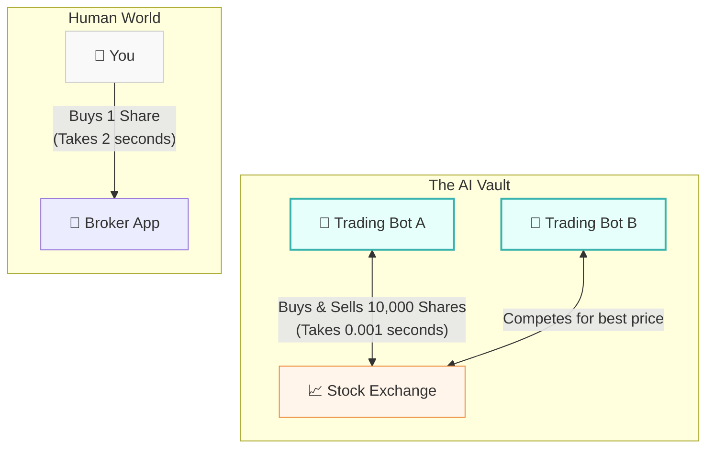
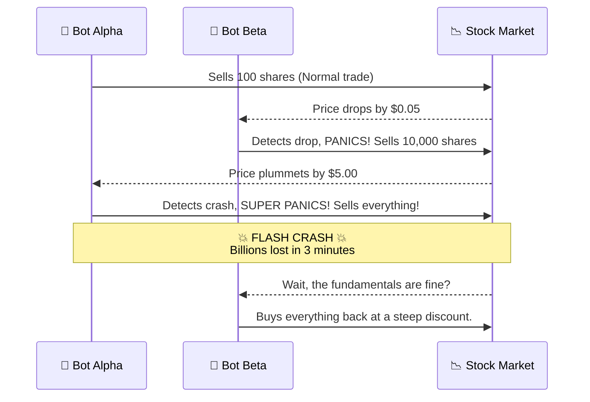

# 🏦 The Vault: A Layman's Guide to AI in Finance & Trading (Line 24)

Welcome to **The Vault** (Line 24 on the AI Metro Map). If you think of AI as a brain, this section is its wallet. Here, algorithms don't write poetry or generate pictures of cats—they move billions of dollars, catch criminals, and occasionally break the stock market. 

Imagine Wall Street, but instead of guys in suits yelling on a trading floor, it's a server farm silently trading stocks faster than you can blink. Welcome to the financial outskirts of AI.

---

## 📖 Table of Contents

* [1. High-Frequency Trading: The Million-Microsecond Auctioneer](#1-high-frequency-trading-the-million-microsecond-auctioneer)
* [2. AI Fraud Detection: The Bouncer at the Bank](#2-ai-fraud-detection-the-bouncer-at-the-bank)
* [3. The Danger Zone: Bot Wars and "Flash Crashes"](#3-the-danger-zone-bot-wars-and-flash-crashes)
* [4. Summary](#4-summary)

---

## 1. High-Frequency Trading: The Million-Microsecond Auctioneer

When you buy a stock on your phone, it might take a few seconds to process. To a human, that's fast. To an AI **High-Frequency Trading (HFT)** algorithm, that is an absolute eternity.

### The Auctioneer Analogy
Imagine a normal auction where a guy talks really fast: *"Do I hear fifty? Fifty-five! Sold!"* 
Now imagine an auction where **a million auctioneers are screaming bids at each other in milliseconds**. They buy a stock for $10.00 and sell it a split second later for $10.01. Earning a penny doesn't sound like much, but when you do it millions of times a day, you become a billionaire.

These AI algorithms look for tiny patterns in the market, news headlines, and even the weather to guess which way a stock will move. 

---

## 2. AI Fraud Detection: The Bouncer at the Bank

Have you ever traveled to another state, tried to buy a coffee, and had your credit card magically declined? You have just met the AI **Fraud Detection Bouncer**.

Every time you swipe your card, an AI looks at thousands of data points in a fraction of a second:
* *"Is this how they usually spend money?"*
* *"Did they just buy gas in New York and a TV in Paris five minutes later?"*
* *"Are they buying gift cards at 3 AM?"*

Instead of a human reviewing paper receipts, the AI acts as a highly paranoid security guard with a photographic memory of every purchase you've ever made. If a transaction looks weird, the bouncer blocks the door.

> [!TIP]
> **False Alarms:** Sometimes the bouncer is *too* strict. This is why buying a surprisingly expensive round of drinks on vacation might temporarily freeze your card. The AI prefers to be safe rather than sorry!

---

## 3. The Danger Zone: Bot Wars and "Flash Crashes"

What happens when you put thousands of super-smart, lightning-fast AI trading bots in the same room and tell them all to make money at the same time? Sometimes, they panic.

### The "Flash Crash"
A **Flash Crash** happens when competing AI bots get caught in a feedback loop. 
1. Bot A sees a tiny drop in a stock and decides to sell.
2. Bot B sees Bot A selling, assumes something is wrong, and also sells.
3. Bot C sees A and B panicking, and dumps everything.
4. Within **minutes**, the stock market loses a trillion dollars of value... and then the bots realize it was a mistake and buy it all back 15 minutes later.

It is the equivalent of someone yelling "Fire!" in a crowded theater, causing a massive stampede, only for everyone to realize someone just dropped a flashlight.

---

## 4. Summary

**The Vault (Line 24)** represents the high-stakes, hyper-fast world of financial AI. 
* It uses **High-Frequency Trading** to make millions of micro-decisions before a human can blink.
* It uses **Fraud Detection** to act as a 24/7 security guard for your wallet.
* But it also comes with massive risks, like **Flash Crashes**, where bots accidentally declare war on the economy over a rounding error.

In the Vault, speed is everything, and the only thing faster than making a million dollars is losing it!
