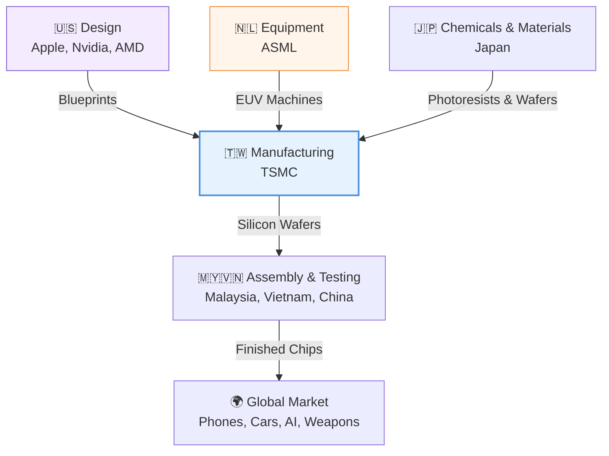

# 🏭 The Foundry: A Layman's Guide to the Geopolitics of Silicon (Line 25)

Imagine trying to build a modern civilization without steel or concrete. It would be impossible. Today, the foundation of our world isn't made of steel—it's made of silicon. Microchips (semiconductors) are the "new oil," powering everything from your smartphone and car to artificial intelligence and advanced military jets. 

But unlike oil, which is pumped out of the ground, microchips require the most complex manufacturing process in human history, relying on a deeply interconnected, highly fragile global supply chain.

---

## 📖 Table of Contents

* [1. The Global Supply Chain: A Relay Race Across the World](#1-the-global-supply-chain-a-relay-race-across-the-world)
* [2. ASML & The Lithography Miracle: Printing NYC on a Grain of Rice](#2-asml--the-lithography-miracle-printing-nyc-on-a-grain-of-rice)
* [3. TSMC & The Bottleneck: Why Taiwan Holds the Keys](#3-tsmc--the-bottleneck-why-taiwan-holds-the-keys)
* [4. The Silicon Cold War: Who Controls the Future?](#4-the-silicon-cold-war-who-controls-the-future)
* [5. Summary](#5-summary)

---

## 1. The Global Supply Chain: A Relay Race Across the World

No single country on Earth can build an advanced microchip entirely on its own. It is a global relay race where everyone has a highly specialized role. If any single runner drops the baton, the entire global economy grinds to a halt.

* **The Architects (US):** Companies like Apple and Nvidia design the chips, but they don't actually build them. 
* **The Toolmakers (Netherlands & Japan):** They build the incredibly precise machines and supply the exotic chemicals required to print the chips.
* **The Master Builders (Taiwan & South Korea):** They take the designs and use the tools to physically manufacture the chips.
* **The Packagers (Southeast Asia & China):** They cut, test, and package the fragile chips into the little black squares you see on a circuit board.

---

## 2. ASML & The Lithography Miracle: Printing NYC on a Grain of Rice

To understand how hard it is to make a chip, you have to look at the machines that print them. The most advanced of these are made by a single company in the Netherlands called **ASML**. They make Extreme Ultraviolet (EUV) lithography machines.

Imagine you are asked to draw a highly detailed street map of New York City, including every alleyway, fire hydrant, and hot dog stand. Now imagine you have to draw that entire map onto a single grain of rice. 

That is effectively what an EUV machine does, but instead of drawing streets, it is carving billions of microscopic electrical switches (transistors) onto a piece of silicon. 

To achieve this, the ASML machine blasts a microscopic droplet of molten tin with a laser 50,000 times a second. This creates a plasma that emits a type of light that doesn't naturally exist on Earth. This light is then bounced off the flattest mirrors ever created to project the chip's blueprint onto the silicon. 

> [!TIP]
> ASML is the **only company in the world** that can build these machines. Without them, it is physically impossible to manufacture the world's most advanced microchips. 

---

## 3. TSMC & The Bottleneck: Why Taiwan Holds the Keys

If ASML builds the oven, **TSMC (Taiwan Semiconductor Manufacturing Company)** is the master baker. 

Decades ago, tech companies designed and built their own chips. Today, the factories (called "Foundries" or "Fabs") have become so insanely expensive—costing up to $20 billion each—that almost no one can afford to run them. Instead, tech giants just draw the blueprints and hire TSMC to build them.

Because TSMC is so good at what they do, they manufacture **over 90% of the world's most advanced microchips**. 

This creates a massive geopolitical bottleneck. A single company on a small island off the coast of China is single-handedly responsible for producing the chips that power everything from American iPhones and AI servers to advanced military defense systems. 

---

## 4. The Silicon Cold War: Who Controls the Future?

Because whoever controls the microchips controls the future of the global economy and military supremacy, we have entered what experts call a **"Silicon Cold War."** 

This isn't a war fought with bullets, but with export controls, subsidies, and trade restrictions. 

* **The Chokehold:** The United States, realizing the danger of China getting its hands on the most advanced AI and military chips, has heavily restricted the export of high-end chips and ASML machines to China.
* **The Push for Independence:** In response, China is pouring hundreds of billions of dollars into building its own domestic chip manufacturing industry from scratch to break free from Western reliance.
* **Bringing it Home:** Terrified by how concentrated the supply chain is in Taiwan (especially given the political tensions with China), the US and Europe are spending massive amounts of money (like the US CHIPS Act) to subsidize companies to build new Foundries on their own soil.

> [!IMPORTANT]
> The geopolitical balance of power no longer just relies on who has the most oil, the most land, or the biggest navy. It increasingly relies on who can produce the smallest, most advanced pieces of silicon.

---

## 5. Summary

The microchip is the heartbeat of the modern world. Its creation is a symphony of mind-bending physics, massive international cooperation, and intense geopolitical rivalry. The "Outskirts" of the tech world are defined by this invisible war, where nations jockey for control over the foundries and machines that will literally dictate the future of human progress.
