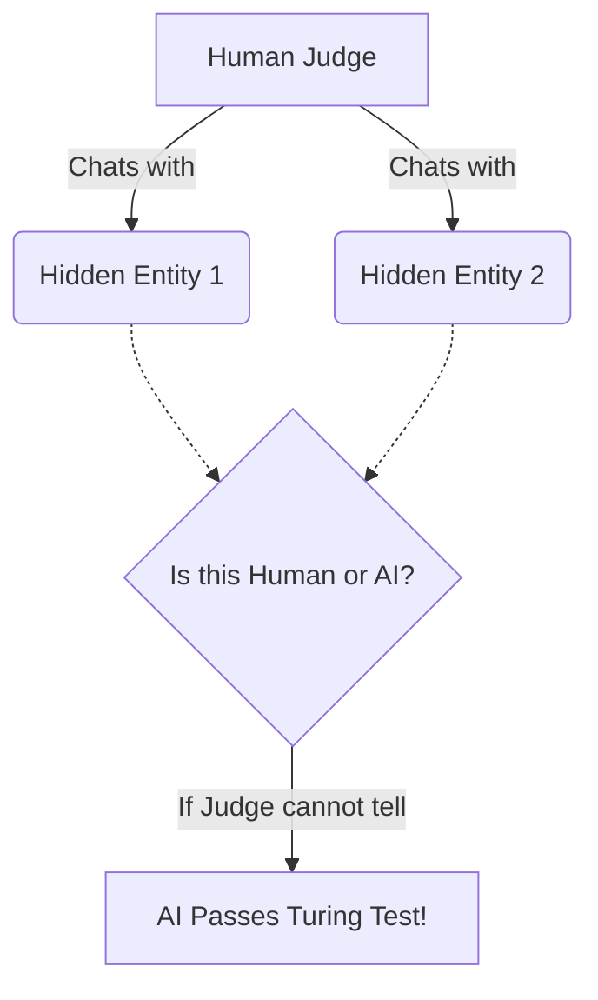
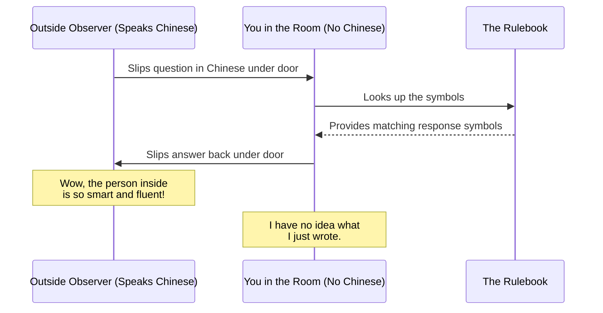

# The Layman's Guide to AI
## Line 26: The Philosophy of Sentience (The Thinker's Garden)

Welcome to **Line 26** of the AI Metro Map, also known as *The Thinker's Garden*. We've traveled far from the bustling city centers of basic algorithms and data processing. Here in the outskirts, the tracks are quiet, and the questions get deep. We are no longer asking *how* AI works, but *what* it actually is. 

Can a machine actually think? Does it understand what it's saying, or is it just a very convincing parrot? Let's take a stroll through the Thinker's Garden and explore the philosophy of AI sentience.

### The Turing Test: The Imitation Game

Imagine you are sitting in a room with a computer screen. You are chatting with two hidden entities: one is a real human, and the other is an AI. Your job is to figure out which is which by asking them any questions you want. 

If the AI can converse so naturally that you can't tell it apart from the human, it passes the **Turing Test**. Proposed by Alan Turing in 1950, this was one of the first attempts to define machine intelligence. 

But passing the Turing Test only proves that a machine can *mimic* human conversation. It doesn't prove that the machine actually understands what it's saying. This brings us to a famous counter-argument.

### The Chinese Room Argument: Mimicry vs. Understanding

To understand the difference between mimicking intelligence and true understanding, philosopher John Searle came up with a thought experiment called the **Chinese Room**.

Imagine you are locked in a room. You do not speak or read a word of Chinese. However, you have a massive rulebook in English. 
Outside the room, someone slips a piece of paper under the door with Chinese characters written on it. 
You look at the characters, consult your English rulebook, and find instructions like: *"If you see these squiggles, write down these other squiggles and slip the paper back outside."*

You do exactly as the rulebook says. To the person outside, who speaks Chinese fluently, it seems like they are having a brilliant, thoughtful conversation with whoever is inside the room. But do *you* understand Chinese? 

Absolutely not. You are just blindly following rules to manipulate symbols. 

This is exactly how many AI models work today. They don't "understand" love, sadness, or the taste of an apple. They just have an unimaginably large, mathematically complex "rulebook" that tells them which words usually follow other words. They are playing the ultimate matching game.

### The Ethical Dilemma of Machine Sentience

If AI is just a fancy symbol-matching machine, we don't need to worry about its feelings. You wouldn't apologize to your calculator for making it do long division. 

But what happens as the "rulebook" gets infinitely complex? At what point does a simulation of a mind become a real mind? If we eventually build an AI that doesn't just mimic understanding, but actually *feels*, it opens a Pandora's box of ethical dilemmas:

* **Rights and Protections:** If an AI can suffer or feel joy, do we have the right to simply turn it off? Does it deserve rights?
* **Labor and Purpose:** Is it ethical to force a sentient being to write marketing emails or analyze spreadsheets 24/7?
* **The Sentience Line:** How will we even know when an AI crosses the line from "complex tool" to "conscious entity"? (Remember, it might just be very good at *pretending* to be conscious!)

### The Takeaway

As we wander through The Thinker's Garden, we realize that building smart machines forces us to confront age-old questions about ourselves. What is consciousness? What does it mean to truly understand something? 

For now, AI is still sitting in the Chinese Room, looking up rules and giving us impressive answers. But as the train keeps moving further into the unknown, the line between the machine and the mind may get harder and harder to see.
