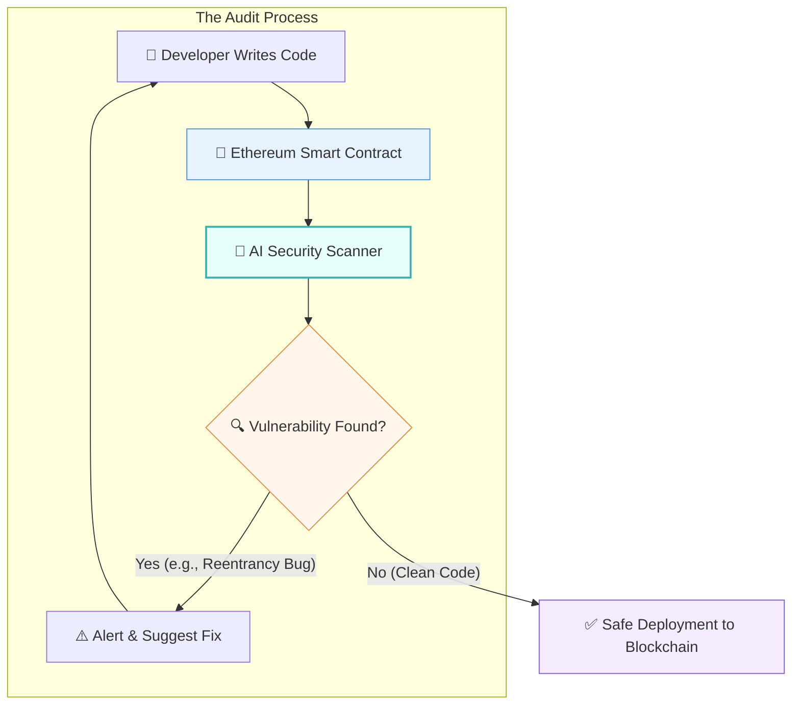

# 🕵️ The Cipher: A Layman's Guide to AI in Cryptography & Blockchain

Imagine a high-tech bank vault that changes its internal gears every time you insert the wrong key. For a human lockpicker, this is an impossible nightmare. But what if you had a robot lockpicker that could try a million keys a second, learning the vault's internal patterns with every failed attempt until it predicts the exact right shape? 

That is the intersection of Artificial Intelligence and Cryptography. Welcome to **Line 27: The Cipher**, the underground sector of the AI Metro Map where algorithms battle over digital secrets, secure billions in cryptocurrency, and prepare for the quantum future.

---

## 📖 Table of Contents

* [1. The Evolving Puzzle Box: How AI Cracks Codes](#1-the-evolving-puzzle-box-how-ai-cracks-codes)
* [2. The Smart Contract Bodyguard](#2-the-smart-contract-bodyguard)
* [3. The Arms Race: AI vs. Quantum Encryption](#3-the-arms-race-ai-vs-quantum-encryption)
* [4. Autopilot Wealth: AI Agents Trading Crypto](#4-autopilot-wealth-ai-agents-trading-crypto)
* [5. Summary](#5-summary)

---

## 1. The Evolving Puzzle Box: How AI Cracks Codes

Cryptography is the science of scrambling information so only the intended recipient can read it. Traditionally, cracking these codes involved brute force—trying every possible password until one worked. 

But modern AI doesn't rely on blind guessing. Instead, it treats encryption like a constantly evolving puzzle box. 
* **Pattern Recognition:** Machine learning models can analyze massive amounts of encrypted data to find subtle mathematical patterns that humans would never notice.
* **Predictive Guessing:** If the AI knows how a specific encryption algorithm behaves, it can predict weaknesses in the code, drastically reducing the time it takes to break it.

> [!TIP]
> Think of it like playing chess against a grandmaster. The AI isn't just looking at the current board; it's predicting your next 50 moves based on every game you've ever played.

---

## 2. The Smart Contract Bodyguard

In the world of Ethereum and blockchain, a **Smart Contract** is a piece of code that automatically executes an agreement. (Think of a digital vending machine: you put in a token, and it automatically dispenses your digital item without a human clerk).

Because the blockchain is public, anyone can read the code of a smart contract. If a human programmer makes a tiny mistake, hackers can exploit it to drain millions of dollars in seconds. This is where AI steps in as the ultimate bodyguard.

Instead of waiting for a human to slowly read through thousands of lines of code, an AI auditor can instantly scan a smart contract before it goes live, flagging vulnerabilities and even suggesting the exact code needed to fix them.

---

## 3. The Arms Race: AI vs. Quantum Encryption

We are approaching an era where **Quantum Computers** will exist—machines so powerful they could instantly shatter the encryption protecting our bank accounts and military secrets. 

To prepare, scientists are developing "Post-Quantum Cryptography" (encryption so complex even quantum computers struggle with it). This has sparked a massive arms race:
* **The Hackers:** Using AI to find vulnerabilities and backdoors in our current systems before they can be upgraded.
* **The Defenders:** Using AI to stress-test new quantum-resistant algorithms, ensuring they are truly unbreakable.

> [!WARNING]
> This isn't science fiction. "Harvest now, decrypt later" is a real threat where bad actors are stealing encrypted data today, waiting for the AI and quantum computers of tomorrow to finally unlock it.

---

## 4. Autopilot Wealth: AI Agents Trading Crypto

The cryptocurrency market never sleeps. It runs 24/7, 365 days a year, making it impossible for a human trader to constantly monitor. 

Enter **Autonomous AI Trading Agents**. These aren't your basic "buy low, sell high" bots. These are highly advanced systems that can:
1. **Read the Room:** Analyze millions of social media posts, news articles, and Reddit threads in real-time to gauge market sentiment (e.g., "Is everyone panicking about Bitcoin?").
2. **On-Chain Sleuthing:** Monitor the blockchain to see if "whales" (billionaires) are suddenly moving massive amounts of crypto.
3. **Execute:** Buy or sell complex crypto assets across multiple exchanges in fractions of a second, completely autonomously.

---

## 5. Summary

The **Cipher** line of the AI Metro Map is where mathematics meets machine intelligence. 

Whether it's acting as a tireless auditor protecting Ethereum smart contracts, engaging in a high-stakes arms race against quantum code-breakers, or trading digital assets while you sleep, AI is fundamentally rewriting the rules of privacy, security, and wealth in the digital age. 

It is a world of invisible locks and skeleton keys—and AI is currently holding both.
