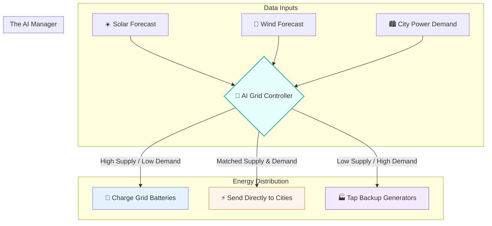

# 🌍 The Thermostat: A Layman's Guide to AI in Climate Engineering (Line 28)

Imagine you are the manager of a massive, global "Weather Control Room." For decades, you and your team have been trying to set the perfect temperature for the planet using a thermostat from the 1970s. The room is either freezing cold or boiling hot. You have thousands of dials, switches, and sensor readings coming from all over the world, but it's simply impossible for a human to read them all fast enough to make the right adjustments.

Enter **AI in Climate Engineering**. Instead of humans frantically pulling levers, we now have an ultra-smart assistant in the control room. This AI can process billions of environmental data points in seconds—predicting when a storm will hit, balancing the world's renewable energy supply, and—most controversially—taking active steps to tweak the climate itself. 

---

## 📖 Table of Contents

* [1. The Crystal Ball: Predicting Climate Chaos](#1-the-crystal-ball-predicting-climate-chaos)
* [2. The Smart Grid: Optimizing Renewable Energy](#2-the-smart-grid-optimizing-renewable-energy)
* [3. The Controversial Button: Geoengineering and Cloud Seeding](#3-the-controversial-button-geoengineering-and-cloud-seeding)
* [4. Summary](#4-summary)

---

## 1. The Crystal Ball: Predicting Climate Chaos

Traditionally, predicting long-term climate behavior has been like trying to guess the exact path of a single drop of water in a roaring river. There are simply too many variables: ocean temperatures, wind speeds, atmospheric pressure, and human emissions. 

AI changes the game by using **Machine Learning models** that don't just follow strict physics formulas—they look for hidden, complex patterns in decades of historical weather data. 

* **Early Warnings:** AI can predict extreme weather events (like hurricanes, flash floods, or mega-droughts) weeks or even months in advance.
* **Hyper-Local Forecasts:** Instead of just knowing that an entire state will get rain, AI can predict exactly which neighborhoods are at the highest risk of flooding.

> [!TIP]
> Think of this AI like an incredibly experienced farmer who can smell rain coming weeks before anyone else. It's not magic; it's just pattern recognition operating on a planetary scale.

---

## 2. The Smart Grid: Optimizing Renewable Energy

One of the biggest challenges with renewable energy is that the sun doesn't always shine, and the wind doesn't always blow. Imagine running a restaurant where your food deliveries arrive at completely random times—you would need an incredibly smart inventory manager to make sure you never run out of supplies.

AI acts as the ultimate **Power Grid Manager**:
* **Predictive Generation:** It uses advanced weather forecasts to predict exactly how much solar and wind energy will be generated tomorrow.
* **Demand Matching:** It analyzes human behavior to predict when everyone will turn on their air conditioners or plug in their electric cars.
* **Storage Optimization:** It decides when to store excess energy in giant batteries and when to release it into the grid, preventing blackouts.

---

## 3. The Controversial Button: Geoengineering and Cloud Seeding

While predicting the weather and managing power grids are universally loved concepts, there's a third, highly controversial track on Line 28: **Geoengineering**. 

If managing the power grid is like adjusting the AC in a room, geoengineering is like ripping out the walls to change the airflow. It involves deliberate, large-scale interventions in the Earth's natural systems, and AI is increasingly being used to run these experiments.

* **Automated Cloud Seeding:** AI systems can analyze real-time cloud data to determine exactly when and where to release chemicals (like silver iodide) from drones into the atmosphere, forcing rainfall in drought-stricken areas.
* **Solar Radiation Management (SRM):** Theoretical AI models are currently simulating what would happen if we sprayed reflective particles into the stratosphere to bounce sunlight away from Earth and cool the planet.

> [!WARNING]
> This is the "Pandora's Box" of climate AI. What happens if an AI decides to seed clouds to water crops in one country, but inadvertently causes a devastating drought in the neighboring country? 

Because the climate is a single, interconnected system, using AI to actively manipulate the weather raises massive ethical and geopolitical questions. It's one thing for the AI to read the thermometer; it's quite another to let it press the buttons.

---

## 4. Summary

**Line 28 (The Thermostat)** represents the ultimate intersection of artificial intelligence and planetary survival. 

Whether it's acting as a crystal ball to predict natural disasters, serving as the invisible conductor of a massive renewable energy grid, or dipping its toes into the dangerous waters of actively modifying our weather patterns, AI is no longer just a tool for writing emails or generating code. It is rapidly becoming the operating system for Earth's climate.
