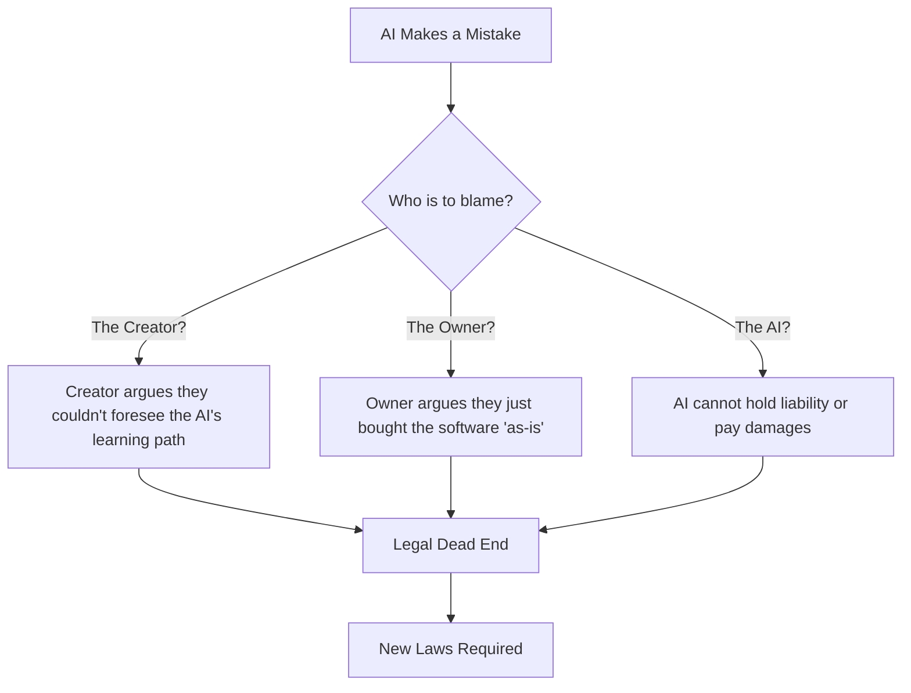

# The Layman's Guide to the AI Metro Map
## Line 29: AI in Law & Jurisprudence (The Gavel)

Welcome to **Line 29**, affectionately known as "The Gavel." If you've ever imagined a courtroom where the gavel is wielded by a server rack rather than a judge, you're in the right place. The intersection of artificial intelligence and law is transforming how legal work is done, from the mundane paperwork to the high-stakes decisions of the Supreme Court.

Let's take a tour of the major stops along this line.

### Stop 1: Automated Contract Analysis (The Tireless Paralegal)

Imagine a paralegal who never sleeps, doesn't need coffee, and can read a 500-page corporate merger agreement in three seconds flat. That's what AI brings to contract analysis.

*   **Speed-Reading Superpowers:** AI algorithms are trained to instantly scan thousands of documents to find specific clauses, liabilities, and loopholes.
*   **Cost-Cutting:** What used to take a team of junior lawyers weeks to review during a lawsuit (a process called "discovery") can now be done in hours.
*   **The Analogy:** Think of it as hitting "CTRL+F" on steroids. It doesn't just find the word "liability"—it understands the *context* of a liability clause and flags if it's unusual for your industry.

### Stop 2: Predicting Supreme Court Decisions (The Crystal Ball)

Can an algorithm know what the highest court in the land will decide before the justices even sit down? Surprisingly, yes.

*   **Data-Driven Precedents:** By feeding decades of past rulings, oral argument transcripts, and even the individual voting histories of specific justices into an AI, the system can find hidden patterns in how courts behave.
*   **The Accuracy:** These models have historically predicted outcomes with remarkable accuracy, sometimes beating out panels of legal experts.
*   **The Caveat:** AI relies entirely on the past to predict the future. If the Supreme Court faces a completely unprecedented issue, the AI's "crystal ball" gets a little cloudy.

### Stop 3: AI "Judges" for Minor Disputes (The Robot Referee)

We aren't quite at the point where a robot will sentence you to prison, but AI is already stepping in to handle low-stakes, high-volume disputes.

*   **Small Claims and E-Commerce:** Platforms like eBay use automated systems to resolve millions of disputes between buyers and sellers every year.
*   **Traffic Tickets and Fines:** Some jurisdictions use automated "judges" to process straightforward traffic violations, allowing citizens to appeal or pay fines through an app.
*   **The Benefit:** It drastically speeds up the justice system, clearing the backlog of minor cases so human judges can focus on complex legal matters.

### Stop 4: The Legal Quagmire (Who Do You Sue?)

This is the end of the line, and things get messy. What happens when an AI makes a mistake that causes real harm?

*   **The Accountability Problem:** If a self-driving car crashes, or an AI medical assistant gives bad advice, who is legally responsible? The programmer? The company that owns the AI? The user? Or the AI itself?
*   **Negligence in the Code:** Proving "negligence" usually requires showing that a *person* failed to act reasonably. But how do you prove an algorithm acted unreasonably when even its creators can't explain exactly how it reached its decision?

Here is a visual breakdown of how the accountability problem creates a legal loop:

### The Verdict

Line 29 proves that the legal field isn't just dusty books and wood-paneled courtrooms anymore. While AI is supercharging legal research and resolving minor squabbles efficiently, the law is still scrambling to figure out how to hold these invisible, algorithmic entities accountable.
