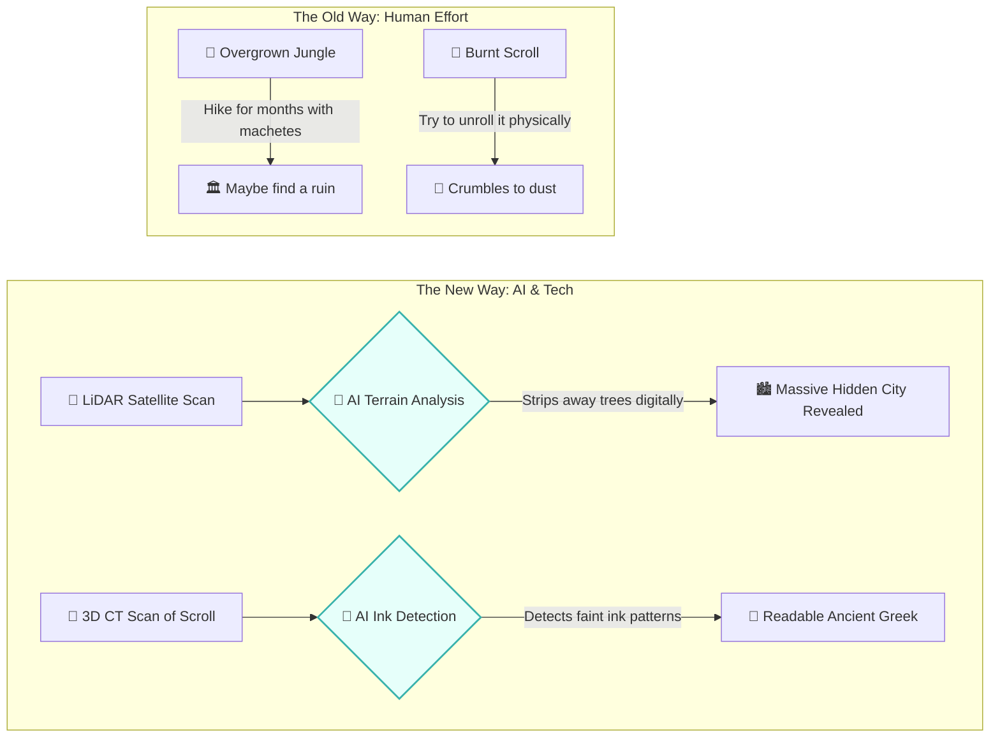

# 🕰️ The Time Capsule: A Layman's Guide to AI in Archaeology & History (Line 30)

Imagine Indiana Jones. Now, imagine if instead of a whip and a fedora, he had a supercomputer, a satellite, and an algorithm that can read invisible ink on a piece of charcoal. That is what is happening on **Line 30** of the AI Metro Map.

Archaeology and history used to be purely about physically digging in the dirt and squinting at dusty old books for decades. Today, Artificial Intelligence is acting as the ultimate digital time machine. It is helping us find lost cities we couldn't see, read languages we had forgotten, and piece together history that we thought was destroyed forever.

---

## 📖 Table of Contents

* [1. The Digital Indiana Jones](#1-the-digital-indiana-jones)
* [2. X-Ray Vision: Translating the Vesuvius Scrolls](#2-x-ray-vision-translating-the-vesuvius-scrolls)
* [3. Finding Hidden Cities: AI and LiDAR](#3-finding-hidden-cities-ai-and-lidar)
* [4. Healing the Past: Restoring Damaged Texts](#4-healing-the-past-restoring-damaged-texts)
* [5. Summary](#5-summary)

---

## 1. The Digital Indiana Jones

For centuries, historical discovery relied on human eyes. If a scroll was burnt to a crisp, it was considered lost. If a jungle grew over an ancient Mayan city, it was hidden. If a medieval manuscript had holes eaten through it by worms, those words were gone. 

AI changes the game because it is incredibly good at **pattern recognition**. It can look at data that looks like absolute noise to a human—like the microscopic texture of a burnt piece of papyrus or the bumpy elevation of a jungle canopy—and instantly spot the hidden structure underneath.

---

## 2. X-Ray Vision: Translating the Vesuvius Scrolls

In 79 AD, Mount Vesuvius erupted, destroying Pompeii and the nearby town of Herculaneum. In Herculaneum, an entire library of ancient papyrus scrolls was flash-fried into lumps of carbon. They looked like burnt cigars. For 2,000 years, they were unreadable. If anyone tried to physically unroll them, they shattered into ash.

Enter the **Vesuvius Challenge**. Scientists used particle accelerators to take insanely detailed 3D X-rays of the rolled-up, burnt scrolls. But the ink they used back then was made of carbon (soot and water), which meant the ink looked exactly the same as the burnt papyrus on an X-ray!

* **How AI fixed it:** Researchers trained an AI to look at the *microscopic texture* of the papyrus. When ink dries on paper, it leaves a microscopic raised bump. The AI learned to spot these microscopic patterns inside the 3D X-ray of the rolled-up scroll.
* **The Result:** The AI successfully "unrolled" the scroll digitally and detected the ink, revealing lost ancient Greek philosophical texts that hadn't been read in two millennia. 

> [!IMPORTANT]
> The AI didn't just translate the text; it physically found the letters inside a solid brick of charcoal without anyone ever touching the fragile artifact.

---

## 3. Finding Hidden Cities: AI and LiDAR

Imagine trying to find a lost city in the Amazon or the jungles of Guatemala. You could walk ten feet away from a giant pyramid and never see it because the trees are so thick.

Today, archaeologists use **LiDAR** (Light Detection and Ranging). They fly airplanes or satellites over the jungle and shoot millions of laser pulses at the ground. Some lasers hit the tops of the trees, but some slip through the leaves and hit the ground.

* **The Problem:** A LiDAR scan generates billions of data points. It takes human researchers years to manually sift through the 3D maps to figure out if a bump in the ground is a natural hill or an ancient temple.
* **The AI Solution:** You feed the LiDAR data into an AI that has been trained on what ancient Mayan or Roman structures look like. The AI digitally "deforests" the jungle, stripping away all the trees in seconds, and instantly highlights perfect squares, roads, and pyramids.
* **The Result:** AI has helped discover tens of thousands of previously unknown Mayan structures in a matter of months, completely rewriting our understanding of how large their civilization was.

---

## 4. Healing the Past: Restoring Damaged Texts

Throughout history, countless books, tablets, and manuscripts have been damaged. Pieces are torn off, water washes away the ink, or holes are eaten by insects. When historians find a document that looks like Swiss cheese, they usually have to guess what the missing words were.

AI acts as the ultimate autocomplete for history. 

> [!TIP]
> Just like how your smartphone guesses the next word you are going to type in a text message, AI can guess the missing words in a 3,000-year-old Babylonian tablet.

* **How it works:** AI models (specifically Neural Networks) are trained on millions of surviving texts from ancient languages like Latin, Ancient Greek, or Cuneiform. 
* **The Process:** When presented with a damaged text with missing gaps, the AI analyzes the context, the grammar, and the historical period, and predicts exactly which words were most likely in the missing holes.
* **The Result:** AI systems like DeepMind's "Ithaca" can restore the missing text of ancient Greek inscriptions with incredible accuracy, and even pinpoint exactly when and where the text was originally written.

---

## 5. Summary

Line 30 of the AI Metro Map is where technology meets antiquity. 

By using AI, we are no longer limited by what human eyes can see or what human hands can carefully brush away. We can digitally unroll burnt scrolls, strip away dense jungles from space, and autocomplete the missing pages of history. 

AI isn't just predicting the future; it is actively helping us rescue our past.
