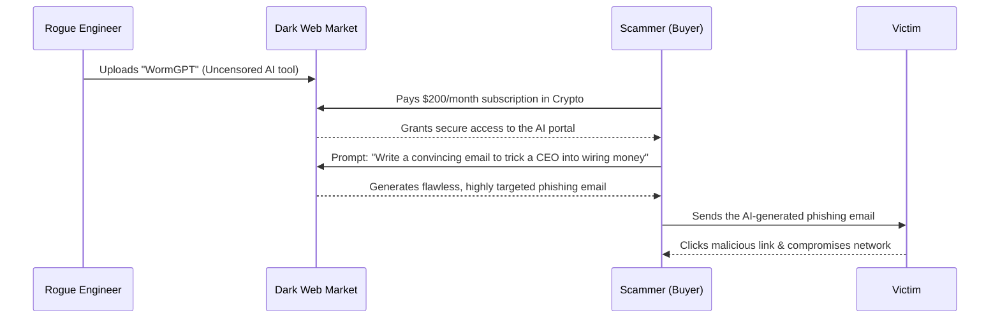

# A Layman's Guide to Line 31: The Shadow Network (The Dark Web & Underground AI)

Imagine you live in a bustling, high-tech city. Above ground, there are shiny skyscrapers, regulated businesses, and police keeping the peace. This is the AI you know—the public transit lines of ChatGPT, Claude, and Gemini. But beneath the streets, hidden from the general public, lies a sprawling, unregulated black market. Welcome to **Line 31: The Shadow Network**.

In this underground section of the AI Metro Map, the safety rails have been removed. This is where cybercriminals, hackers, and bad actors trade in malicious AI tools designed to deceive, steal, and disrupt.

Here is a breakdown of what you'll find in the dark alleys of the Shadow Network.

## 1. Unregulated and Uncensored Models: "The Jailbroken Tools"

When major tech companies release an AI model, they include "guardrails." If you ask a standard AI how to build a bomb or write a computer virus, it will politely refuse.

In the Shadow Network, these guardrails are intentionally broken. 
* **The Analogy:** Think of a standard AI as a factory-made car with a speed limiter and safety sensors. An uncensored model is like an illegal street-racing car where the mechanic has stripped out the seatbelts, disabled the speed limits, and strapped a rocket to the roof. It's powerful, but incredibly dangerous.
* **How it works:** Hackers take open-source AI models and "fine-tune" them on malicious data, actively stripping away their ethical constraints. These uncensored models will happily write phishing emails, generate malware code, or provide step-by-step instructions for illegal activities.

## 2. Dark Web AI Services (FraudGPT): "Crime-as-a-Service"

You've probably heard of "Software-as-a-Service" (like paying a monthly fee for Netflix or Microsoft Office). The dark web has created **Crime-as-a-Service**.

* **The Analogy:** Instead of having to learn how to pick locks yourself, you pay a monthly subscription to a shadowy syndicate that hands you a master key and provides a getaway driver whenever you need them.
* **How it works:** Tools with names like *FraudGPT* or *WormGPT* are sold on dark web forums. They offer subscription plans (e.g., $200 a month) that give amateur criminals access to advanced AI. These tools can automatically generate highly convincing scam emails, create fake websites that look exactly like your bank, or find vulnerabilities in a target's computer network. You no longer need to be a coding or hacking genius to be a cybercriminal; you just need a credit card.

## 3. Automated Propaganda Botnets: "The Digital Megaphones"

In the past, spreading misinformation required human "troll farms"—rooms full of people typing out fake posts. AI has automated this entirely, scaling it up to an unimaginable degree.

* **The Analogy:** Imagine hiring a million invisible people, giving them all megaphones, and having them stand in every town square in the country shouting the same lie until people start believing it’s the truth.
* **How it works:** Bad actors use AI to generate thousands of fake social media profiles that look incredibly real (complete with AI-generated human faces). These bots then use language models to write millions of unique, persuasive posts, comments, and articles designed to sway elections, ruin reputations, or pump up the price of a scam cryptocurrency. Because the text is uniquely generated by AI every time, it doesn't look like a standard "copy-paste" spam attack, making it much harder for platforms to detect and block.

## 4. The Underground Economy: "The Black Market Bazaar"

None of this operates in a vacuum. There is a thriving, multi-million dollar economy supporting this malicious AI ecosystem.

* **The Analogy:** It’s a digital black market bazaar where different specialists trade their wares and services using untraceable currency. 
* **How it works:** In this economy, you have a fully functioning supply chain:
    * **Model Trainers:** The rogue engineers who build the uncensored AI.
    * **Data Brokers:** Thieves who steal personal data (passwords, emails, social security numbers) and sell it to the AI trainers to make their scams highly personalized.
    * **Platform Providers:** The hackers who host these illicit AI services on secure, hidden servers on the dark web.
    * **The Customers:** Everyday scammers who buy access to launch their attacks. 
    * Transactions are almost entirely handled in cryptocurrencies (like Bitcoin or Monero) to remain anonymous.

## The Lifecycle of a Shadow Network Attack

To understand how these pieces fit together, let's look at how an underground AI attack is orchestrated from start to finish:

## The Bottom Line

Line 31 represents the dark underbelly of the AI revolution. While surface-level AI is being used to cure diseases, write code, and boost productivity, the Shadow Network is weaponizing the exact same technology. Understanding how this digital black market operates is the first step in recognizing and defending against the next generation of automated cyber threats.
