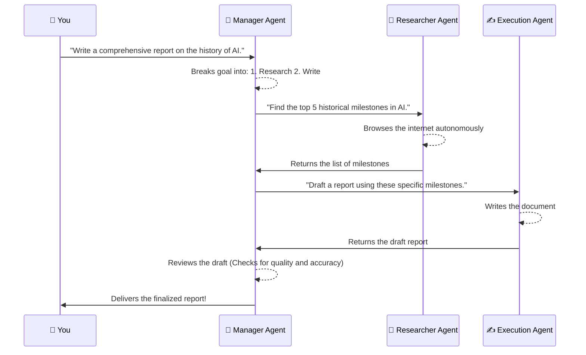

# Line 32: Auto-GPT and Autonomous Agents (The Swarm)

Welcome to Line 32! If the previous stops on the AI Metro Map were about giving computers a brain, this stop is about giving them a **job**, a **team**, and a **manager**. 

We are entering the "Stratosphere" of AI—the realm of **Autonomous Agents** like Auto-GPT. Instead of just answering a single question, these AI systems can break down massive, long-term goals into smaller tasks, assign them to different specialized AI "workers," and execute them completely on their own without needing a human to click "next."

---

## 🐝 The Hive-Mind: How AI Agents Work Together

Think of a traditional AI (like standard ChatGPT) as a brilliantly smart consultant locked in a room. You slide a piece of paper under the door asking a question, and it slides an answer back. It's incredibly smart, but it only acts when *you* give it a prompt.

**Autonomous Agents** are different. Imagine unlocking that door and putting that consultant in a bustling office building filled with other AI specialists:
*   **The Project Manager Agent:** Takes your big goal (e.g., "Plan a marketing campaign for my new shoe brand") and breaks it down into an actionable to-do list.
*   **The Researcher Agent:** Browses the live web to find current shoe trends and competitor prices.
*   **The Writer Agent:** Takes the research data and drafts catchy social media posts.
*   **The QA/Critic Agent:** Reviews the drafts, notices they are a bit boring, and tells the Writer Agent to make them punchier before finalizing.

These agents **communicate with each other**, passing information back and forth just like a real human team in a Slack channel. They collaborate, argue, and iterate, working relentlessly until the overarching goal is achieved. 

---

## 🎯 Executing Long-Term Goals (No Humans Required)

How does an AI stay on track for days or weeks without you holding its hand? It uses a continuous, self-correcting loop of **Thinking, Acting, and Observing**.

Here is how an agentic workflow tackles a complex problem:

1.  **Goal Setting:** You give the swarm a massive task (e.g., "Build a working website for a local pizza shop").
2.  **Planning:** The AI manager creates a step-by-step roadmap (write the HTML, generate pizza images, write the menu copy).
3.  **Execution & Delegation:** Specialized worker agents pick up their assigned tasks and get to work.
4.  **Feedback & Adaptation:** If an agent encounters a roadblock—like writing a line of code that produces an error—it doesn't just stop and give up. It reads the error message, realizes its mistake, rewrites the code, and tries again until it works. 

### 📊 The Agentic Workflow in Action

Here is a simplified look at how an autonomous agent swarm processes and delegates a complex task:

---

## 🚀 The Future: "Agentic" Workflows

We are moving rapidly away from treating AI as a simple conversational tool (like a highly advanced calculator) and towards treating it as a **collaborator** or even a **digital employee**.

In the near future, "Agentic" workflows will be the standard across industries:
*   **Personal Assistants that actually assist:** An agent that doesn't just remind you about your mother's birthday, but independently researches her favorite flowers, orders them online, and tracks the delivery to her door.
*   **Software that builds software:** Swarms of AI developer agents writing, testing, debugging, and deploying entire applications from scratch while you sleep.
*   **24/7 Digital Companies:** Businesses where the customer service, data analysis, and marketing departments are entirely run by specialized AI swarms communicating seamlessly in the background.

Line 32 isn't just about smarter AI; it's about **independent** AI. Welcome to the swarm!
