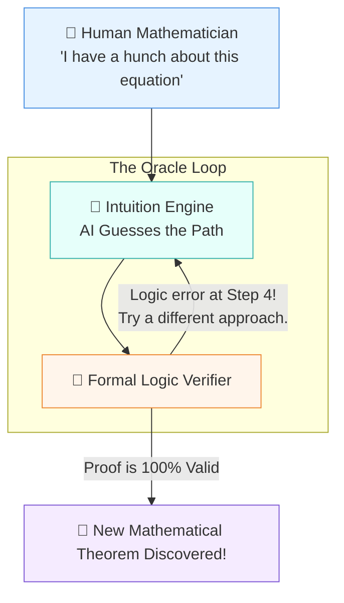

# 🔮 The Oracle: A Layman's Guide to AI in Mathematics & Theorem Proving (Line 33)

Imagine you have a puzzle box with a billion interlocking pieces. A regular computer might try every possible combination one by one—a process that could take until the end of the universe. A traditional language AI, like ChatGPT, might just guess what a solved puzzle looks like based on pictures it has seen before (and sometimes accidentally draw pieces that don't exist).

But what if you had a **digital Einstein**? An AI that doesn't just guess or calculate, but actually *understands* the underlying rules of the puzzle, finding elegant shortcuts and discovering entirely new ways to solve it.

Welcome to **Line 33 of the AI Metro Map: Mathematics & Theorem Proving**. This is the Stratosphere of AI, where machines are moving beyond just predicting the next word to discovering fundamentally new mathematical truths and helping physicists unlock the universe's deepest secrets.

---

## 📖 Table of Contents

* [1. Beyond Just "Predicting Words"](#1-beyond-just-predicting-words)
* [2. What is Theorem Proving? (The Math Detective)](#2-what-is-theorem-proving-the-math-detective)
* [3. How the Oracle Works](#3-how-the-oracle-works)
* [4. From Abstract Math to the Laws of Nature](#4-from-abstract-math-to-the-laws-of-nature)
* [5. Summary](#5-summary)

---

## 1. Beyond Just "Predicting Words"

Most of the AI you interact with today (like chatbots) are essentially super-powered autocomplete systems. They are brilliant at predicting the most likely next word in a sentence based on human text. But math isn't about what "sounds right"; it's about what is **provably, absolutely true**.

* **Standard AI:** "The sky is usually blue, so I'll say 'blue'." (Probabilistic guessing)
* **The Oracle AI:** "Here is a step-by-step logical proof showing exactly why the sky must be blue under these specific conditions, and there are zero errors in my logic." (Rigorous deduction)

To do this, AI has to shift from being a smooth talker to a rigorous philosopher.

---

## 2. What is Theorem Proving? (The Math Detective)

In mathematics, a **theorem** is a statement that has been proven to be true based on existing rules (axioms). 

> [!TIP]
> Think of it like a detective solving a crime. The detective can't just say, "I think the butler did it because it feels right." They have to provide an unbroken chain of evidence (a proof) from the crime scene to the suspect. 

Historically, humans have spent lifetimes trying to build these chains of evidence for complex mathematical problems. Now, AI is stepping in as the ultimate detective's assistant.

---

## 3. How the Oracle Works

Instead of just calculating numbers, the Oracle uses AI combined with strict logic engines (like Lean or Coq) to explore the infinite landscape of mathematics.

### 🧠 The Two Halves of the Oracle brain
1. **The Intuition Engine (The Guesser):** Advanced neural networks (like AlphaGeometry) look at a problem and use intuition to suggest a potential path forward, much like a human genius having a "Eureka!" moment.
2. **The Logic Verifier (The Judge):** A strict mathematical system checks every single step of the AI's proposed proof. If there is even a tiny flaw, it rejects it.

They loop back and forth. The Intuition Engine keeps proposing brilliant ideas, and the Verifier keeps checking them until a perfect proof is found.

---

## 4. From Abstract Math to the Laws of Nature

Why does discovering abstract math matter to the average person? Because math is the language of the universe!

When AI learns to prove theorems and understand deep mathematics, it doesn't just stay on a chalkboard. It spills over into the physical world:
* **Physics:** Helping scientists discover new fundamental laws of nature, mapping out the behavior of quantum particles or the dynamics of black holes.
* **Materials Science:** Predicting the existence of new materials for better batteries or superconductors before they are even synthesized in a lab.
* **Cryptography:** Ensuring that our digital security and banking systems are based on mathematically unbreakable foundations.

By acting as a tireless research partner, the AI Oracle allows human physicists and mathematicians to leap over decades of tedious calculations and focus on pure discovery.

---

## 5. Summary

Line 33 is where AI stops being just a mimic of human language and becomes an active discoverer of fundamental truth. 

By combining the creative intuition of neural networks with the unbreakable rigor of mathematical logic, the **Oracle** is helping humanity map out the uncharted territories of math and physics. It is not replacing the human genius; it is acting as a digital Einstein, partnering with us to unlock the deepest secrets of reality.
