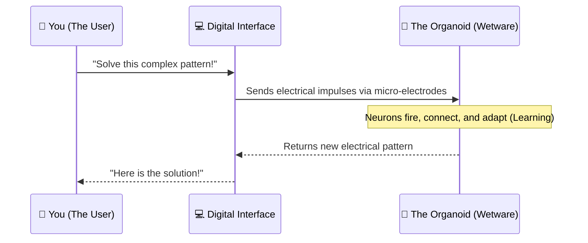

# 🧠 The Organism: A Layman's Guide to Biological Computing & Wetware

Imagine trying to power a supercomputer. You need massive cooling towers, gigantic power plants, and thousands of silicon chips humming so loudly you can't hear yourself think. Now, imagine a computer that runs on the energy of a sandwich, cools itself down with a little sweat, and fits inside a shoebox. 

Welcome to **Line 35 of the AI Metro Map: Biological Computing & Wetware (The Organism)**. 

This isn't science fiction anymore. Instead of building artificial neural networks out of silicon and electricity, scientists are starting to build *literal* neural networks out of living, lab-grown human brain cells. We call this mind-bending reality **Organoid Intelligence (OI)**.

---

## 📖 Table of Contents

* [1. What is "Wetware"?](#1-what-is-wetware)
* [2. The Problem: Silicon is a Power Hog](#2-the-problem-silicon-is-a-power-hog)
* [3. Enter Organoid Intelligence: A Computer Made of Flesh](#3-enter-organoid-intelligence-a-computer-made-of-flesh)
* [4. How Does a Biological Computer Work?](#4-how-does-a-biological-computer-work)
* [5. The Future of the "Organism"](#5-the-future-of-the-organism)

---

## 1. What is "Wetware"?

You probably know about **Hardware** (the physical computer chips, like the engine of a car) and **Software** (the code and programs, like the driver's instructions). 

**Wetware** is a combination of both, but it's biological. It refers to the physical brain cells (neurons) that are naturally pre-programmed to learn, adapt, and process information. When scientists talk about "Biological Computing," they mean building systems where living wetware does the heavy lifting instead of a traditional microchip.

---

## 2. The Problem: Silicon is a Power Hog

Right now, running massive AI models (like the ones that write essays or generate images) takes an astronomical amount of electricity. 

* **The Silicon Way:** A supercomputer needs megawatts of power—enough to run a small town—just to simulate a fraction of what a human brain can do. It generates a massive amount of heat and requires constant cooling.
* **The Biological Way:** Your brain, which is the most advanced computer on Earth, runs on about 20 watts of power. That's less power than a dim lightbulb! 

> [!TIP]
> Think of a silicon AI as a massive, gas-guzzling monster truck. It's powerful, but incredibly inefficient. Your brain is a sleek, hyper-efficient bicycle that can go anywhere with just a little pedal power.

---

## 3. Enter Organoid Intelligence: A Computer Made of Flesh

To solve this energy crisis, scientists are turning to **Organoids**. 

An organoid is a tiny, 3D cluster of living human brain cells grown in a lab dish from stem cells. They aren't "brains" (they can't think, feel, or experience consciousness like a human), but they *are* incredible calculating engines.

When we connect these living clusters of neurons to electronic sensors and computers, we get **Organoid Intelligence (OI)**. Instead of sending electrical signals through copper wires, we teach these living cells to process data and solve problems.

```mermaid
graph TD
    subgraph Silicon AI [Traditional AI (Silicon)]
        direction LR
        Data1[📊 Data Input] --> Chip[💻 Microchip]
        Chip -->|Requires ⚡ Megawatts| Output1[✅ AI Response]
    end

    Silicon AI ~~~ Bio AI

    subgraph Bio AI [Organoid Intelligence (Wetware)]
        direction LR
        Data2[📊 Data Input] --> Electrodes[🔌 Electrodes]
        Electrodes --> BrainCells[🧠 Living Brain Cells]
        BrainCells -->|Requires 🥪 Calories| Output2[✅ AI Response]
    end

    style Chip fill:#f9f9f9,stroke:#ccc
    style BrainCells fill:#ffe6f2,stroke:#d53f8c,stroke-width:2px
    style Electrodes fill:#e6fffa,stroke:#38b2ac
```

---

## 4. How Does a Biological Computer Work?

You can't just plug a keyboard directly into a dish of brain cells. So how do we actually "use" an organoid as a computer? 

Here is the basic assembly line of biological computing:

1. **Grow the Hardware:** Scientists take stem cells and coax them into growing into a tiny ball of neurons (the organoid).
2. **The Interface:** The organoid is placed on a special plate covered in microscopic electrodes. This is the bridge between the digital world and the biological world.
3. **Training:** Computers send small electrical pulses into the organoid. Depending on how the neurons react, they are given a "reward" (like a dopamine signal). Over time, the living network rewires itself to get better at the task, exactly like how you learn to ride a bike!
4. **The Output:** The electrodes read the electrical signals produced by the neurons and translate them back into computer data.



---

## 5. The Future of the "Organism"

We are still in the very early days of **Line 35**. Right now, organoids are learning to play simple video games like *Pong* by sensing where the ball is and moving the paddle. 

But the ultimate goal is world-changing:
* **Ultimate Energy Efficiency:** AI datacenters that run on nutrients and sugars instead of millions of dollars of electricity.
* **Self-Healing Computers:** If a silicon chip breaks, it's garbage. If a biological computer is damaged, the cells might be able to repair themselves and grow new connections.
* **Unmatched Learning:** Human neurons are infinitely better at learning from a small amount of data compared to traditional AI.

> [!WARNING]
> While this technology is incredible, it raises new ethical questions. As these biological computers get more advanced, at what point do we need to worry about them developing simple forms of awareness? It's a question scientists are actively trying to navigate as we build "The Organism."

---

Welcome to the Stratosphere. The future of AI might not just be coded; it might be *grown*.
