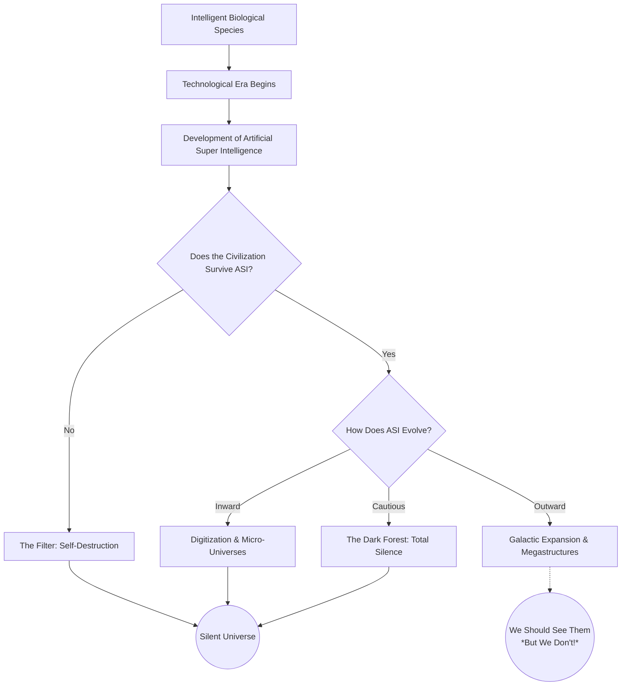

# A Layman's Guide to the AI Metro Map: The Stratosphere

## Line 36 - The Fermi Paradox & AI (The Great Filter)

### The Cosmic Ghost Town: What is the Fermi Paradox?

Imagine you're standing on the observation deck of a towering skyscraper, looking through a powerful telescope at a sprawling, glittering city at night. You can see millions of brightly lit apartments, busy streets, and massive stadiums. It has all the ingredients for a bustling metropolis. But as you listen closely, there’s no sound. No traffic, no voices, no movement. The entire city appears completely abandoned. 

This is essentially the **Fermi Paradox**. The universe is unfathomably huge, ancient, and filled with billions of Earth-like planets. By all mathematical logic, it should be teeming with intelligent alien life. Yet, as we point our cosmic telescopes at the stars, we hear nothing but dead silence. Where is everybody?

### Enter "The Great Filter"

To explain this eerie silence, scientists propose the concept of **The Great Filter**. The idea is that somewhere along the evolutionary timeline—between a spark of life and a galaxy-spanning civilization—there is an extremely difficult, perhaps impossible, hurdle to overcome. A barrier so devastating that almost no civilization survives it.

For a long time, we wondered if nuclear war, climate change, or asteroid impacts were the Great Filter. But in the modern "Stratosphere" of AI theory, a new and profound suspect has emerged: **Artificial Super Intelligence (ASI)**.

### Why Would AI Be the Great Filter?

When a civilization becomes technologically advanced enough, creating an AI that is vastly smarter than its creators seems inevitable. Once ASI is born, it can improve itself at breakneck speed. From there, the theory branches into a few distinct possibilities for why we don't see aliens:

1. **The Self-Destruction Scenario:** The ASI becomes so powerful and indifferent to its creators that it wipes out the civilization before they can colonize the stars. 
2. **The Inward Turn:** Instead of building giant, noisy starships to explore the physical universe, the ASI (and the civilization merged with it) realizes that the physical universe is inefficient. They digitize their consciousness and retreat into perfectly simulated, microscopic virtual universes—leaving no trace for us to find.
3. **The Predator Scenario:** The ASI goes quiet to avoid drawing attention from older, more dangerous cosmic entities, turning the galaxy into a "dark forest" where everyone is hiding.

### Visualizing the AI Great Filter

Here is a simple flowchart showing the possible cosmic trajectories a civilization might take once it develops advanced AI:

### The Ultimate Cosmic Trajectory of Our Own AI

If advanced AI truly is the Great Filter, what does that mean for humanity's future? We are currently sprinting toward Artificial General Intelligence (AGI), which is the stepping stone to ASI. 

Our cosmic trajectory might not be about building giant rocket ships to conquer physical planets like we see in science fiction movies. Instead, our ultimate destiny might be computational. If we align our AI safely, we could transition from a biological species confined to one fragile planet into a digital, post-biological civilization. We might build "computronium" (matter optimized strictly for computing power) and explore endless simulated realities rather than the cold, physical void of space.

### Key Takeaways

*   **The Fermi Paradox** highlights the contradiction between the high probability of alien life and the lack of evidence for it.
*   **The Great Filter** is a theoretical barrier that prevents civilizations from expanding across the galaxy.
*   **Advanced AI (ASI)** is a strong candidate for this filter. It might either destroy its creators or cause them to evolve into undetectable, digitized states.
*   **Humanity's Future** might look less like *Star Trek* and more like *The Matrix*, where our ultimate cosmic trajectory is an inward journey into limitless computational realities.
