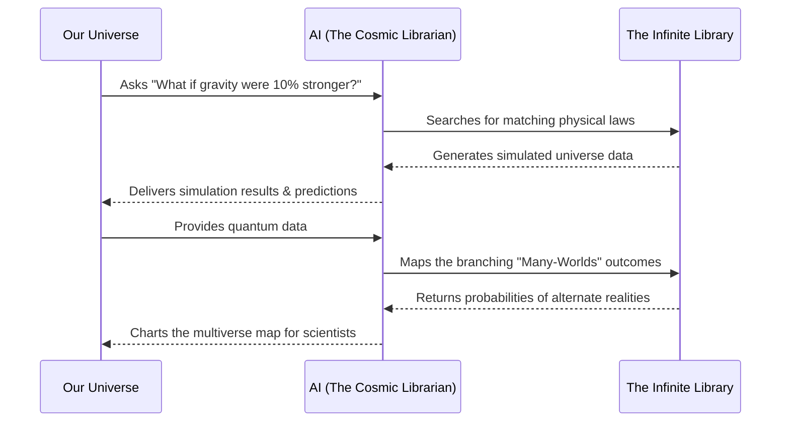

# Layman's Guide to the AI Metro Map: Line 37 - AI and the Multiverse (The Parallel Architect)

Welcome aboard **Line 37**, the most mind-bending route on the AI Metro Map! If you've ever found yourself wondering "what if?", this is your stop. Here, AI isn't just analyzing our world—it's building, mapping, and predicting entirely new realities. We call this station the **Parallel Architect**.

## What is the Parallel Architect?

Imagine an infinitely large library where every book contains a different version of reality. In one book, gravity is so weak that mountains float. In another, you had pancakes for breakfast instead of cereal. 

Navigating this "infinite library" would be impossible for a human librarian. There are simply too many books, branching off into endless possibilities! That's where AI steps in. As the **Parallel Architect**, AI acts as the ultimate cosmic librarian, capable of reading, categorizing, and even simulating these infinite books of alternate realities. 

Here is how AI is exploring the multiverse:

### 1. Simulating Universes with Different Laws of Physics
What would happen if the speed of light were cut in half? Or if atoms repelled each other instead of binding together?
*   **The Sandbox of the Gods:** AI can simulate entire universes inside a computer by tweaking the fundamental laws of physics. It can run the clock forward to see if these alternate universes would collapse instantly or flourish with strange new stars.
*   **Why It Matters:** By seeing how these "bizarro universes" play out, scientists can better understand the delicate, precise balance of physics that allows our own universe to exist and support life.

### 2. Mapping the Quantum Multiverse (Many-Worlds Interpretation)
In quantum physics, the "Many-Worlds" theory suggests that every time a decision or quantum event happens, reality splits into parallel timelines. 
*   **The Cosmic Family Tree:** AI algorithms are used to map out these branching paths. It calculates the probabilities of different quantum outcomes, effectively charting the branches of a near-infinite cosmic tree.
*   **Why It Matters:** This helps quantum physicists make sense of incredibly complex data, turning a chaotic web of infinite possibilities into a structured, understandable map.

### 3. Predicting Alternate Realities
Have you ever flipped a coin and wondered what the version of you who got "tails" is doing?
*   **The Ultimate "What If" Machine:** AI can take current data (about weather, economics, or even human behavior) and run countless simulations of how things *might* have played out if one small variable changed. 
*   **Why It Matters:** While we can't literally travel to these alternate realities, these predictions help us make better decisions in *our* reality—like preparing for a storm that *might* happen, or avoiding an economic crash based on how alternate scenarios unfolded.

## How the Cosmic Librarian Works

Here is a visual breakdown of how our AI librarian navigates the multiverse of possibilities:

## Summary
Line 37 takes us beyond the limits of our own universe. By simulating new physics, mapping quantum branches, and predicting alternate timelines, AI is helping us understand not just the universe we live in, but the infinite universes we *could* be living in. 

Next time you wonder "what if," just remember: somewhere out there, on a parallel track of the AI Metro Map, the Parallel Architect has already mapped it out.
