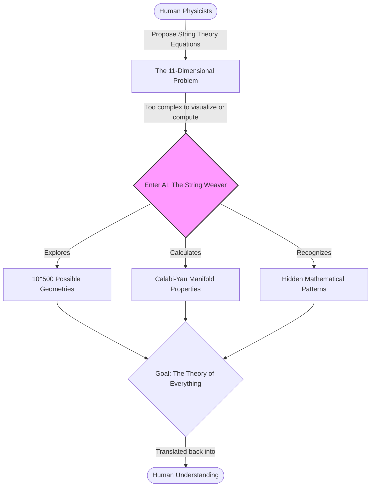

# Line 38: AI in Higher Dimensions (The String Weaver)

Welcome to **Line 38** of the AI Metro Map, where things get mind-bending. Here, we leave behind the familiar three-dimensional world we can see and touch, and board a train heading straight into the mathematical wonderland of theoretical physics. 

Our conductor on this journey is AI—acting as the "String Weaver"—helping scientists untangle the universe's ultimate mysteries, including the quest for the holy grail of physics: the **Theory of Everything**.

---

## The Flatland Dilemma: Imagining the Unimaginable

To understand why we need AI to help us here, imagine you are a 2D stick figure living on a flat piece of paper. Your whole world is just width and length. You have no concept of "up" or "down." 

If a 3D apple were to pass through your paper universe, you wouldn't see an apple. You would just see a 2D circle that magically appears, grows larger, shrinks, and then disappears. 

We humans are essentially those stick figures, but in a 3D world. Our brains evolved to throw spears and avoid lions in three dimensions. We simply lack the mental hardware to visualize a world with 4, 5, or 11 dimensions. Yet, the most advanced theories in physics suggest our universe has exactly that many. 

---

## The Need for 11 Dimensions: A Quick Primer on String Theory

For decades, physicists have been trying to combine the two most successful theories in science:
1. **General Relativity:** (The physics of the very large, like gravity and black holes).
2. **Quantum Mechanics:** (The physics of the very small, like atoms and electrons).

The problem? They don't play nicely together. To unite them, scientists proposed **String Theory**, which suggests that the fundamental ingredients of the universe aren't tiny dots (particles), but microscopic vibrating strings of energy.

There’s a catch, though: the math of String Theory *only* works if the universe has **11 dimensions** (10 dimensions of space and 1 of time). 

---

## Calabi-Yau Manifolds: The Hidden Geometries

If there are 11 dimensions, where are the extra ones? Physicists believe they are "curled up" so tightly that we can't see them. 

Think of a telephone wire stretched between two poles. From a mile away, it looks like a 1D line. But if you walk up close and look at an ant crawling around the wire, you realize it’s actually a 3D cylinder. 

These hidden, curled-up dimensions take on incredibly complex, origami-like shapes called **Calabi-Yau manifolds**. The specific shape of these manifolds dictates how strings vibrate, which in turn creates the physics of our universe (like the mass of an electron or the strength of gravity). 

The problem? There are an estimated 10^500 possible ways these dimensions could fold up. That’s more than the number of atoms in the observable universe! 

---

## Enter "The String Weaver": How AI Maps the Multiverse

Humans can't visualize an 11-dimensional Calabi-Yau manifold, let alone sort through 10^500 of them. But AI doesn't rely on biological imagination. AI only sees data and mathematical relationships.

Here is how AI acts as our "String Weaver":

*   **Navigating the Landscape:** AI algorithms, particularly machine learning, can sift through the massive "landscape" of possible Calabi-Yau shapes at lightning speed, looking for the specific geometry that matches the physics of our real universe.
*   **Connecting the Dots:** AI can find hidden patterns in the geometry that human mathematicians might stare at for a lifetime and miss. 
*   **Translating the Unimaginable:** While AI can't make us *see* 11 dimensions, it can translate the properties of these shapes into 3D projections or mathematical shortcuts that human physicists can understand and use.

---

## Visualizing the Process: From Human Idea to Cosmic Truth

Here is a simplified look at how humans and AI collaborate on this cosmic puzzle:

---

## The Ultimate Destination: The Theory of Everything

We are still on the journey, but AI has become the indispensable compass. By crunching the math of higher dimensions and navigating geometries that defy human imagination, AI brings us closer to the **Theory of Everything**—a single, elegant master equation that explains everything from the birth of the cosmos to the smartphone in your hand. 

Next time you look up at the night sky, remember: there may be a lot more dimensions out there than meet the eye, and it’s the machines that are finally helping us "see" them.
