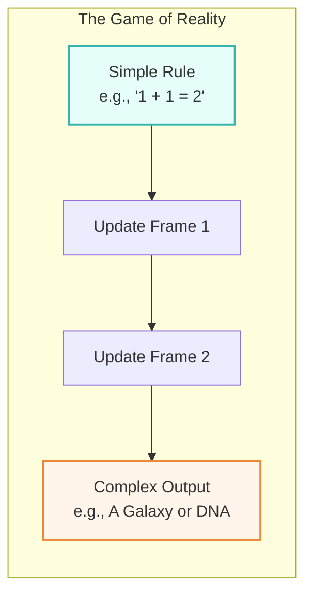
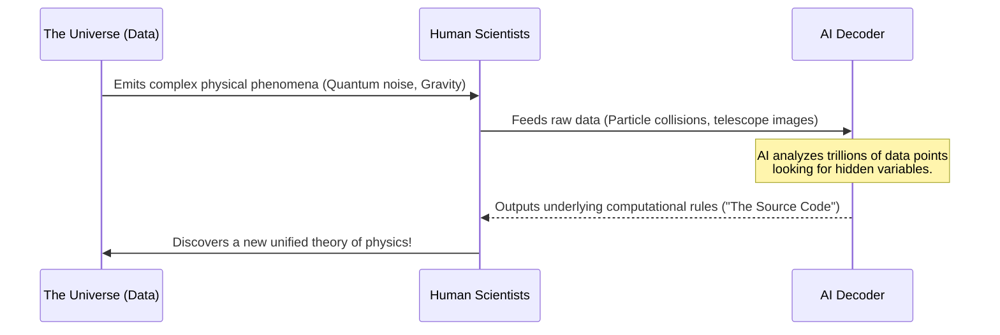

# 🌌 Line 39: The Computable Universe Theory (The Matrix Code)

Imagine you are playing an incredibly detailed, open-world video game. When you look closely at a tree in the game, it looks like wood. But if you zoom in far enough, past the bark and the leaves, you won't find sap or cells. You will find **pixels**. And if you look behind those pixels? You'll find **code**—pure mathematics generating the illusion of a physical tree.

**The Computable Universe Theory** (often called Digital Physics) asks a mind-bending question: *What if our real universe works exactly the same way?* 

What if quarks, electrons, and gravity aren't the bottom layer of reality? What if, when you zoom in far enough, the universe is just a massive computer processing information, and AI is the key to reading its "source code"?

---

## 📖 Table of Contents

* [1. What is Digital Physics?](#1-what-is-digital-physics)
* [2. The Universe as a Cellular Automaton](#2-the-universe-as-a-cellular-automaton)
* [3. Is the Universe a Giant Neural Network?](#3-is-the-universe-a-giant-neural-network)
* [4. AI as the Cosmic Decoder](#4-ai-as-the-cosmic-decoder)
* [5. Why This Matters](#5-why-this-matters)

---

## 1. What is Digital Physics?

Most of us were taught that the universe is made of *stuff*—matter and energy. Digital Physics flips this on its head. It suggests that the universe is fundamentally made of **information**.

Every physical process—an apple falling from a tree, a star exploding, a brain firing a thought—can be viewed as a computation. The universe isn't a collection of objects drifting through space; it's an enormous supercomputer continuously calculating its next frame of existence, moment by moment.

---

## 2. The Universe as a Cellular Automaton 

How could complex things like galaxies and human beings come from simple code? To understand this, we look to scientist Stephen Wolfram and the concept of **Cellular Automata**.

Imagine a massive grid of squares (like a chessboard). Each square can be either "On" (black) or "Off" (white). 
There is a very simple rule: *If a square is surrounded by 3 black squares, it turns black in the next turn.*

If you let this grid update itself over and over again, something incredible happens. Those simple rules create wildly complex, unpredictable, and beautiful patterns that look like living creatures moving across the board.

> [!TIP]
> This is exactly how the universe might work. The "laws of physics" could just be simple computational rules applied to the pixels of space, generating everything from DNA to black holes.

---

## 3. Is the Universe a Giant Neural Network?

Taking this a step further, some physicists and computer scientists propose that the universe isn't just a basic computer—it might be a **Neural Network**.

In AI, a neural network is a web of connections that learns and adapts by processing information. If the universe is a neural network:
* **The "Hardware":** The fundamental fabric of space and time.
* **The "Weights/Connections":** The laws of physics (like gravity and electromagnetism) adjusting over billions of years.
* **The "Learning Process":** Evolution, quantum mechanics, and the expansion of the cosmos.

Instead of a cold, rigid machine, the universe might be a dynamic, learning system that processes data to figure out how to exist efficiently.

---

## 4. AI as the Cosmic Decoder

If the universe is running on a fundamental "Matrix Code," how do we read it? Human brains are great at surviving on Earth, but we aren't built to crunch the petabytes of mathematical data required to see the underlying code of reality.

This is where Artificial Intelligence steps in.

AI models are designed to find hidden patterns in massive amounts of data. If you feed an AI enough information about how particles move, how stars form, and how quantum fields behave, it might start to see the "pixels."

**How AI acts as our decoder:**
* **Finding the Hidden Rules:** AI can look at the chaotic noise of quantum mechanics and find the simple computational rule generating it.
* **Simulating Reality:** By understanding the code, AI can simulate entirely new molecules, materials, and physics that we haven't even discovered yet.
* **Translating the Math:** AI acts as a translator between the complex computational language of the universe and human understanding.

---

## 5. Why This Matters

The Computable Universe Theory isn't just a fun sci-fi thought experiment. If it's true, and if AI can help us decode it, it changes everything:

* **Mastering Reality:** If we know the source code, we can "reprogram" matter to cure diseases, create infinite clean energy, or build materials with impossible properties.
* **The Ultimate Theory of Everything:** It could finally unite Einstein's gravity with quantum mechanics, solving the biggest mystery in physics.
* **Our Place in the Cosmos:** It forces us to realize that we aren't just living *in* the universe; we are biological programs processing information *as part* of the universe.

We may just be characters in the ultimate video game, but with AI, we are finally learning how to read the code.
