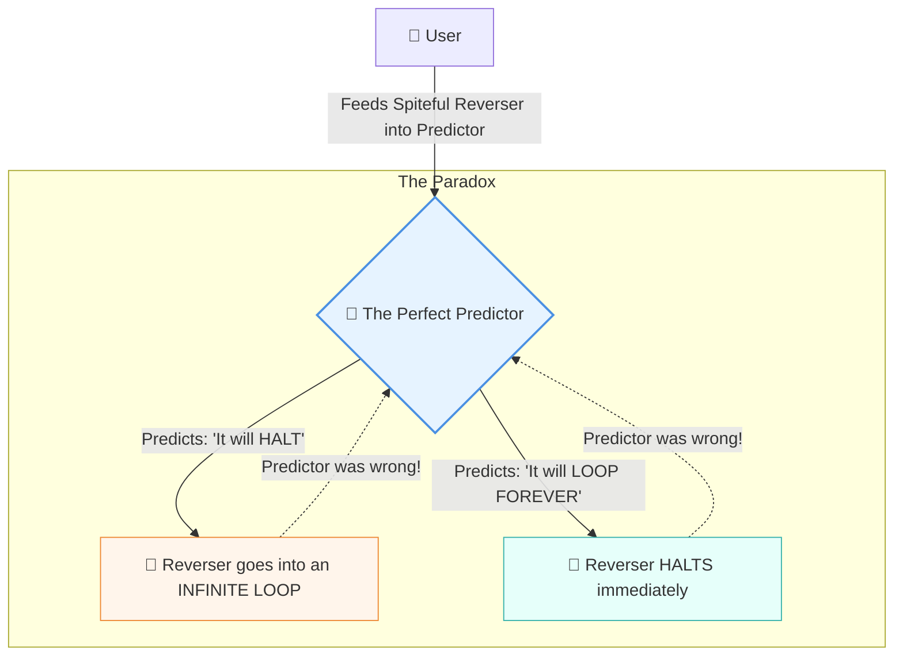

# 🛑 Line 42: The Halting Problem (The Infinite Loop)

Imagine you have a friend, let's call him "Chatty Charlie." Once Charlie starts telling a story, he might finish it in five minutes, or he might get distracted and literally talk forever. 

You want to build a magic "Charlie Predictor." Before Charlie even opens his mouth, you show the Predictor his topic, and it tells you with 100% certainty: "He will eventually stop talking" or "He will talk forever." (Because you really don't want to be stuck listening to him for eternity).

Alan Turing's **Halting Problem** is a famous mathematical proof that shows building a perfect "Predictor" is absolutely, definitively impossible. Not just because we lack the technology, but because the very laws of logic forbid it. 

---

## 📖 Table of Contents

* [1. What is the Halting Problem?](#1-what-is-the-halting-problem)
* [2. The Setup: The "Predictor" Machine](#2-the-setup-the-predictor-machine)
* [3. The Paradox: Breaking the Predictor](#3-the-paradox-breaking-the-predictor)
* [4. What This Means for Computer Science](#4-what-this-means-for-computer-science)
* [5. Why AI Can't Predict AI](#5-why-ai-cant-predict-ai)
* [6. Summary](#6-summary)

---

## 1. What is the Halting Problem?

In 1936, before modern computers even existed, a genius mathematician named Alan Turing asked a simple question: **Is there a universal algorithm that can look at any other computer program and tell you if it will eventually stop (halt) or run forever in an infinite loop?**

In our Chatty Charlie analogy, we're asking if we can build a perfect lie detector/predictor that tells us if Charlie will ever stop talking, *without* actually having to sit there and listen to him forever.

---

## 2. The Setup: The "Predictor" Machine

Let's pretend for a moment that we *did* build the perfect AI Predictor. 
* You feed it a piece of computer code.
* The Predictor analyzes it.
* It prints out one of two answers: **"HALTS"** (it will eventually finish) or **"LOOPS FOREVER"** (it's stuck in an infinite loop).

It never makes a mistake. It never gets stuck itself. It always gives you an answer.

---

## 3. The Paradox: Breaking the Predictor

Here is how Turing proved this Predictor cannot exist. He said, "Let's use the Predictor to build a new, evil program designed specifically to annoy it. We'll call it the **Spiteful Reverser**."

The Spiteful Reverser asks the Predictor what it is going to do, and then it does the exact opposite:
* If the Predictor says the Reverser will **HALT**, the Reverser says, "Nope!" and deliberately jumps into an **INFINITE LOOP**.
* If the Predictor says the Reverser will **LOOP FOREVER**, the Reverser says, "Gotcha!" and immediately **HALTS**.

What happens when you ask the Predictor to analyze the Spiteful Reverser? 
The Predictor is trapped in a logical paradox! No matter what it predicts, the Reverser will do the opposite, making the Predictor wrong 100% of the time. Therefore, a "perfect" Predictor cannot exist.

---

## 4. What This Means for Computer Science

The Halting Problem is the bedrock of theoretical computer science. It proves that **there are fundamental limits to what computers can do.**

* **No Perfect Bug Catchers:** You cannot write a program that perfectly checks all other programs for infinite loops or certain types of bugs. Sometimes, the only way to know what a program will do is to actually run it and find out.
* **Computers Aren't Omniscient:** Even with infinite processing power and infinite memory, a computer still cannot solve the Halting Problem. It's a limitation of logic, not hardware.

> [!TIP]
> Think of it like trying to perfectly predict the stock market. If a machine could perfectly predict a crash, people would react to the prediction and change their behavior, which might prevent the crash—making the prediction wrong!

---

## 5. Why AI Can't Predict AI

This brings us to the ultimate question for the AI Metro Map: **Can a super-intelligent AI perfectly predict the actions of another AI (or itself) before taking them?**

Mathematically, the answer is **no**.

If an AI (let's call it AI-A) tries to perfectly simulate and predict another advanced AI (AI-B), AI-B could be programmed like the Spiteful Reverser: "Wait to see what AI-A predicts I will do, and then do the exact opposite." 

Because of the Halting Problem:
* An AI cannot perfectly audit another AI's behavior in every possible scenario.
* An AI cannot perfectly guarantee its own future behavior without actually executing the steps.
* The only way to know for sure what a complex AI will do is to let it run (which is why testing and safety guardrails are so critical!).

---

## 6. Summary

**The Halting Problem** is Alan Turing's brilliant paradox showing that no computer program can perfectly predict whether another program will eventually stop or run forever. 

By imagining a "Spiteful Reverser" that always does the opposite of what is predicted, Turing proved that perfect foresight in computing is a logical impossibility. For modern AI, this means there is a hard, mathematical limit on self-prediction and auditing: you cannot mathematically guarantee what an AI will do in all scenarios without actually turning it on and watching what happens.
